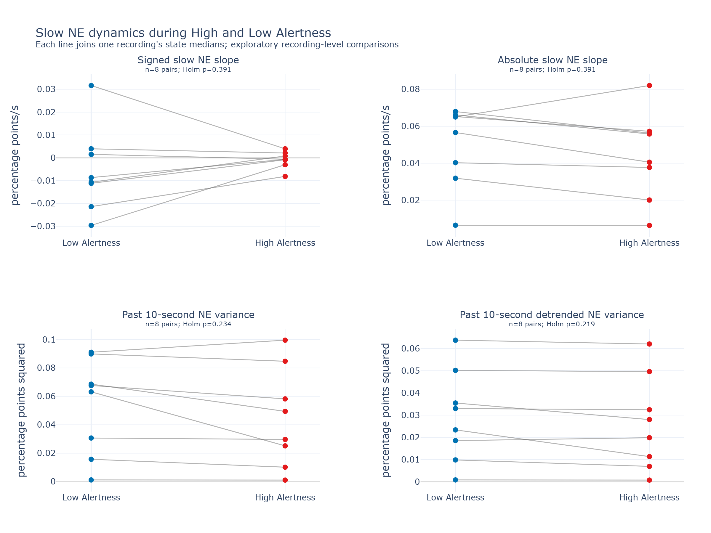

**Superseded on September 23, 2026.** The current analysis uses all ten aligned files and pooled seconds. This snapshot preserves the earlier, superseded eight-file recording comparison. Its commands describe the older implementation.

# Slow NE dynamics during High and Low Alertness

**Status:** exploratory eight-recording analysis, September 23, 2026.

None of the four planned measures established a High/Low Alertness difference
after correction for multiple comparisons. A descriptive pattern nevertheless
recurs: **absolute slow slope, ordinary trailing variance, and detrended trailing
variance are each higher in Low Alertness in 7 of 8 recordings**. These are
recordings, including repeated sessions, not eight independent mice.

## Results

Each recording supplies a median feature value for High Alertness and one for
Low Alertness. The High and Low columns below summarize those eight recording
medians. Tests compare the paired values, without treating seconds as replicates.

| Measure | High Alertness | Low Alertness | Recordings with Low > High | Unadjusted p | Holm-adjusted p |
|---|---:|---:|---:|---:|---:|
| Signed slow NE slope (percentage points/s) | -0.000640 | -0.009698 | 3/8 | 0.3828 | 0.3906 |
| Absolute slow NE slope (percentage points/s) | 0.04820 | 0.06083 | 7/8 | 0.1953 | 0.3906 |
| Past 10-second NE variance (percentage points squared) | 0.03956 | 0.06542 | 7/8 | 0.0781 | 0.2344 |
| Past 10-second detrended NE variance (percentage points squared) | 0.02393 | 0.02818 | 7/8 | 0.0547 | 0.2188 |



Each line joins the same recording's Low and High summary. Different recordings
have different fluorescence scales; the tests retain within-recording pairing.
The three 7-of-8 directions do not constitute three independent replications:
the features come from the same signals and are related measurements.

The closest result is detrended variance, but its unadjusted p = 0.0547 and
adjusted p = 0.2188 do **not** establish a significant difference. The observed
direction motivates further investigation; it does not establish that Low
Alertness generally has greater NE variability across animals.

## What was measured

- **Signed and absolute slow slope:** the saved processed NE was low-pass filtered
  at an effective 0.1 Hz cutoff with zero phase. A line was fitted within each
  score second; its slope and absolute magnitude were retained.
- **Trailing variance:** for a second starting at time `s`, variance uses all NE
  samples in `[s-10, s)`, ending immediately before that second. The additional
  0.1 Hz filter is not applied to this measurement.
- **Detrended trailing variance:** the same history window, after removing its
  fitted straight-line trend.

The preceding history may contain **any states**, including sleep. It is neither
excluded nor split at score boundaries. The feature is assigned to the current
second's unchanged label: 4 High Alertness, 5 Low Alertness.

## Coverage and interpretation

Eight of ten local MAT files passed the duration rule fixed before inspecting
the results. `mouse5_day1.mat` was excluded for a 6.246-second NE/score duration
mismatch, and `408_yfp.mat` for a 24.683-second mismatch. Sources were not repaired,
trimmed, or rewritten. This input set therefore differs from the earlier
ten-recording report.

The included files contain 21,157 High and 5,288 Low seconds. Slopes are available
for 20,945 High and 5,269 Low seconds; variances for 21,110 High and 5,277 Low
seconds. Missing estimates arise from technical signal boundaries, incomplete
history, invalid NE, or incomplete final seconds, never from state crossings.

Mouse and condition metadata were not supplied for this run. The eight-file
screen is consequently an unverified collection of recordings. Independent-mouse
inference and confirmation in new recordings remain pending. No cutoff/window
sweep, feature selection based on p-values, or changes to source labels were used.

## Reproduction and technical details

```powershell
conda activate sleep_scoring_dash3.0
python scripts/analyze_ne_dynamics.py --input-dir data --feature-dir data/derived_features/ne_dynamics_v1_20260923 --results-dir results/ne_dynamics_v1_20260923
python scripts/render_ne_dynamics.py --results-dir results/ne_dynamics_v1_20260923 --png
```

Commands require new or empty output directories. Choose fresh suffixes if the
completed outputs already exist. The feature directory contains one NPZ per
eligible recording and a loading README. The result directory contains the
complete source audit, recording/state summaries, paired comparisons, generated
report, and run provenance. Standalone HTML versions accompany the PNG figures
under the results directory's `figures/` folder. The displayed PNG was copied to
`writeups/assets/ne_dynamics_20260923/` for this report.

The filter is a fourth-order Butterworth applied forward and backward, with its
design cutoff compensated to give a combined -3 dB response at 0.1 Hz. Each finite
NE segment is filtered separately using odd reflection padding; a fixed 30-second
guard at both segment ends is excluded from slopes. Variances require a complete
finite 10-second history and divide by sample count; detrended variance is the
mean squared OLS residual. No per-recording or per-state scaling is applied.

Each state's summary is the median over its available seconds. Tests are
two-sided paired Wilcoxon across recording medians, with Holm correction over
the four planned features. The detailed generated table also gives paired
High-minus-Low effects and approximate, unadjusted percentile bootstrap intervals
from 10,000 resamples of recording pairs. Those intervals estimate a median
difference; they do not invert the Wilcoxon test, do not account for shared
animals, and must not override the corrected test result.

See [feature definitions](../../wake_ne_analysis/ne_dynamics.py) and
[statistical definitions](../../wake_ne_analysis/dynamics_summary.py) for executable
details. Optional verified metadata enables pooling seconds within each mouse
and condition before the state medians are computed.
