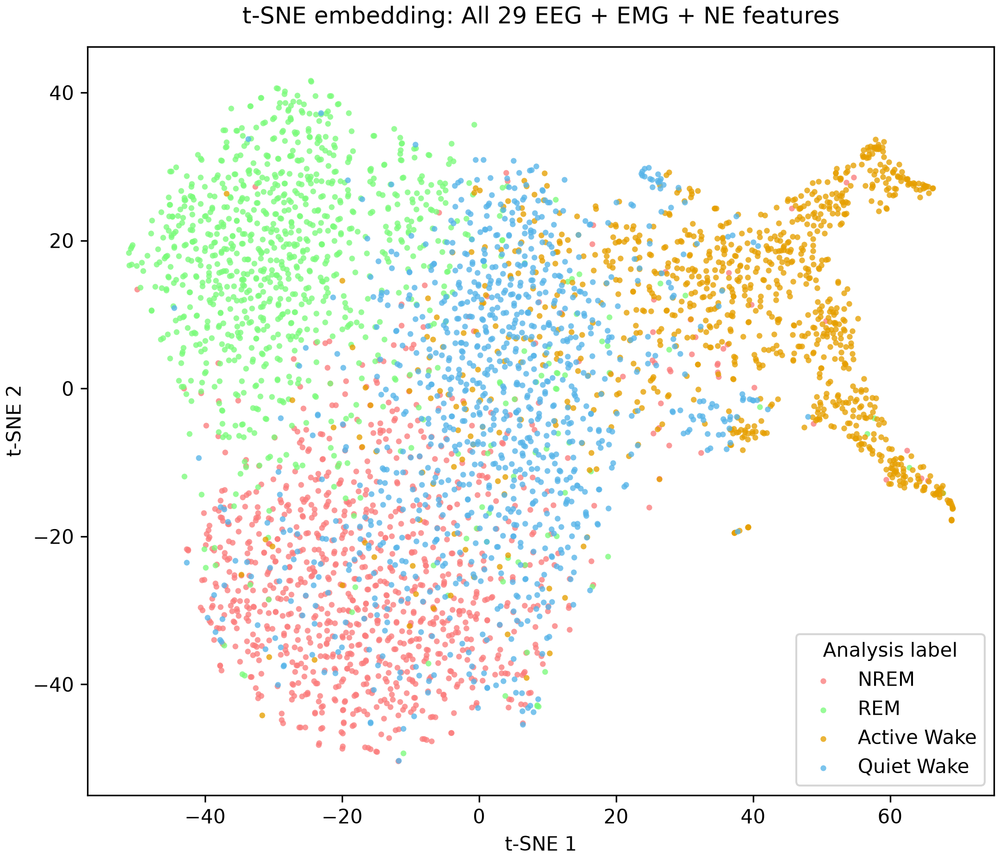
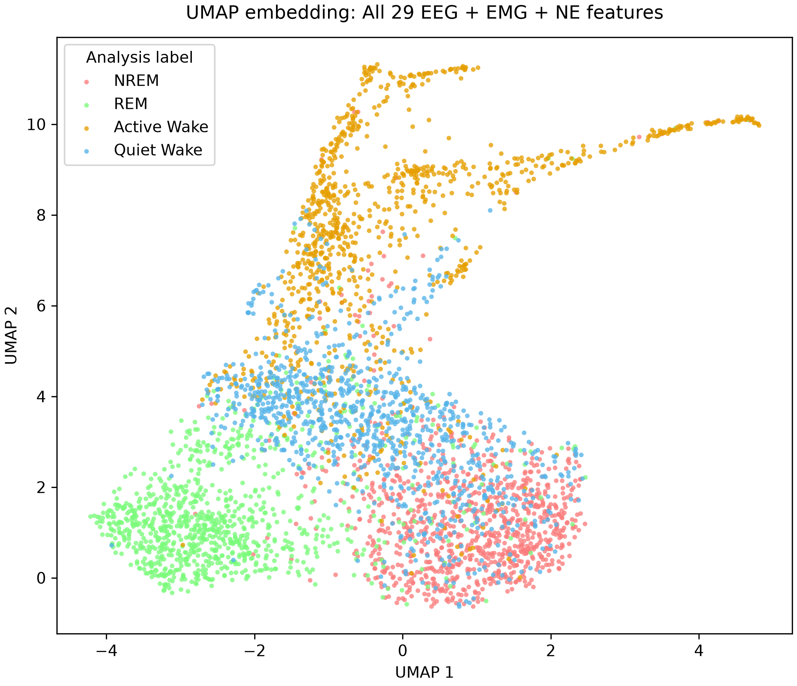
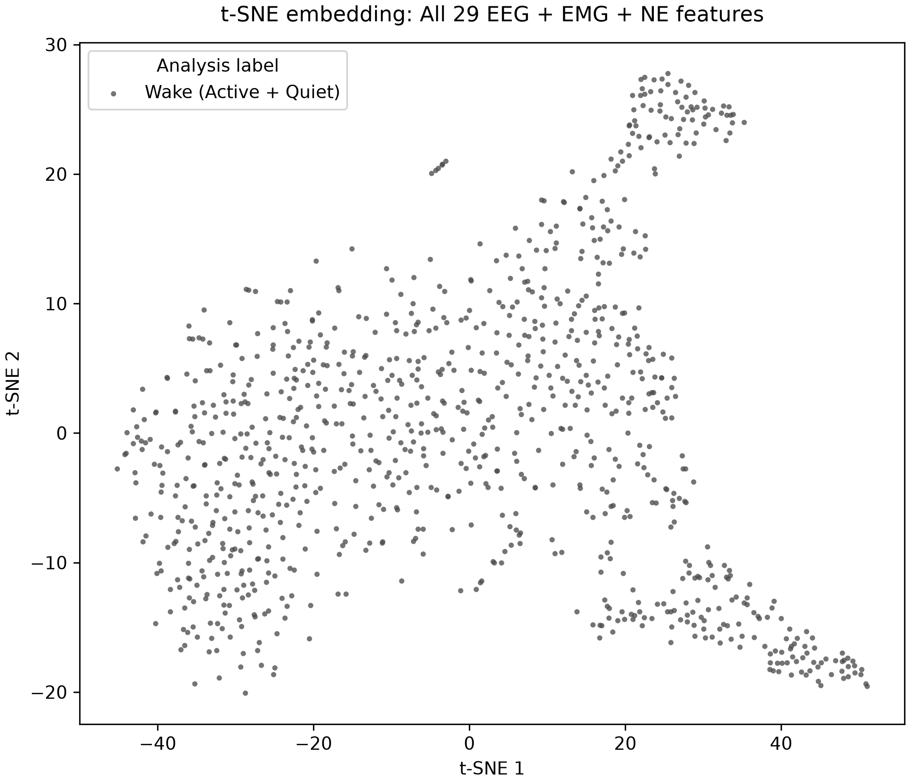
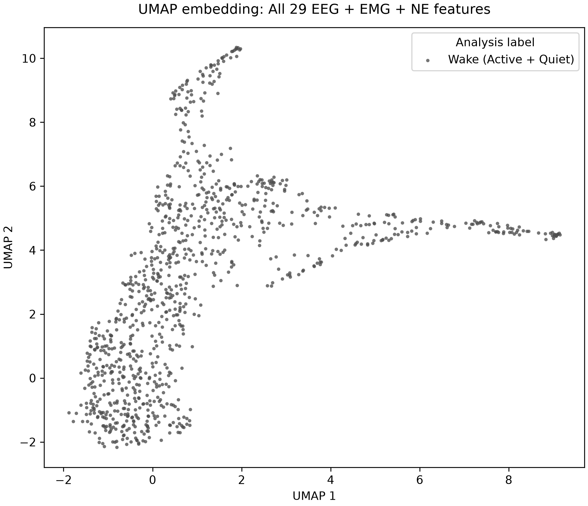
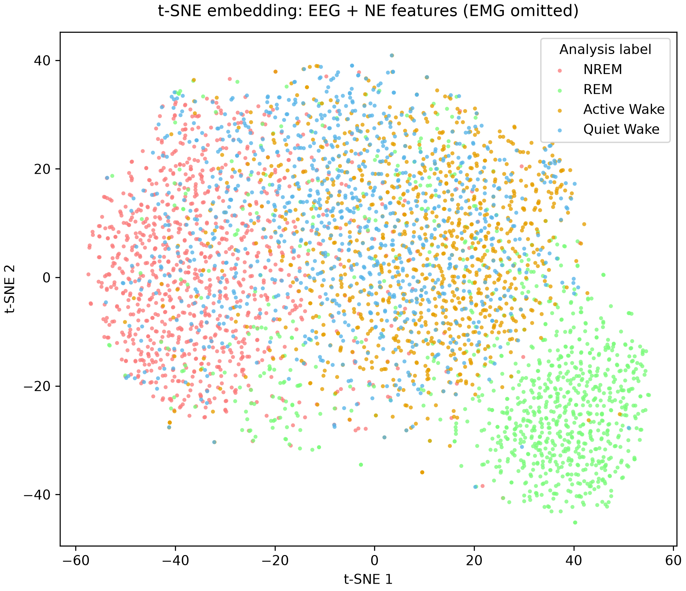
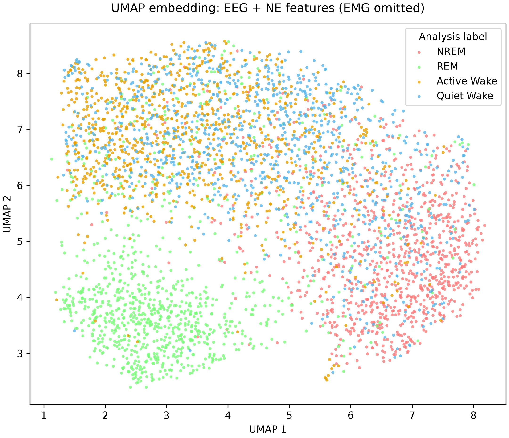
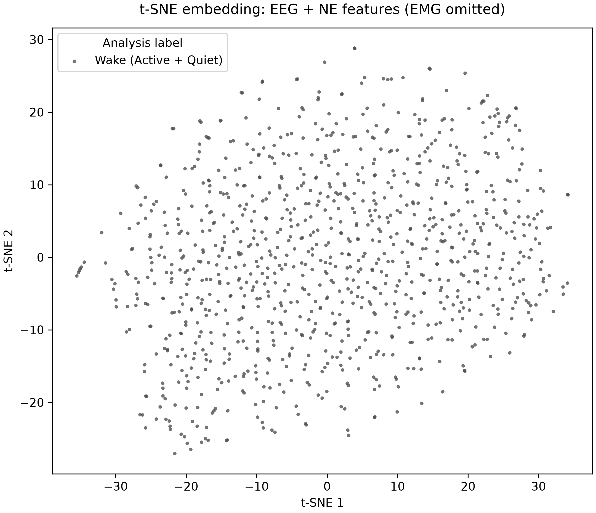
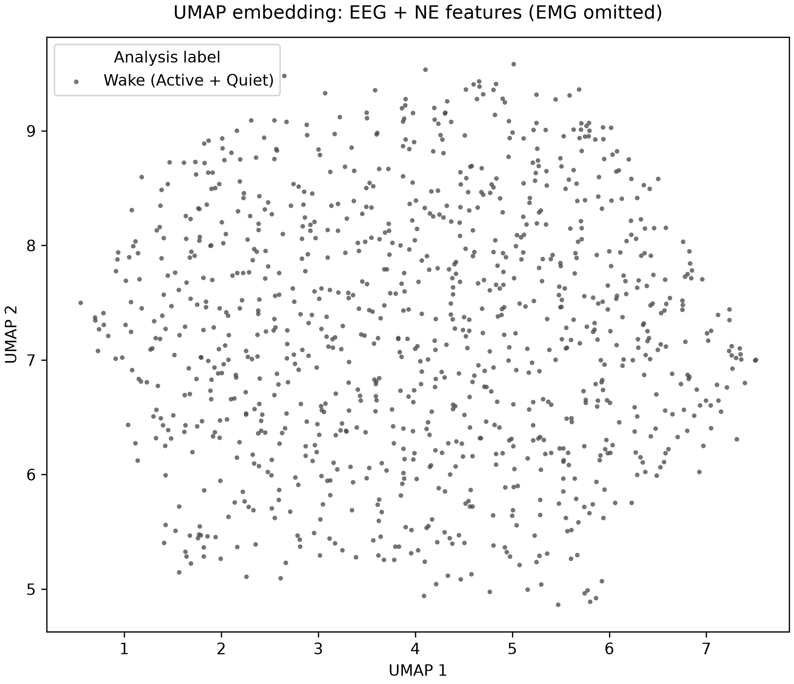

# Cluster visualization report

**Status:** completed on 2026-09-17 for the expanded 29-feature comparison.
Four fixed-seed runs use all features or EEG+NE only, each for all non-MA stages
and combined Wake only. The prior four-feature report is retained at
[`archived/cluster_visualization_report_20260917_four_feature.md`](archived/cluster_visualization_report_20260917_four_feature.md).

## Question

Each point is one final-labelled second from the same ten recordings. t-SNE and
UMAP are fit without labels; labels are used only after fitting to colour the
all-stage figures. The combined-Wake figures intentionally hide the Active/Quiet
subdivision to ask whether the broader Wake population itself shows visible internal
geometry. These are descriptive maps, not a formal cluster test or an inference
about independent biological observations.

## Features

The runs read the saved, within-recording robust-scaled matrices in
`features/features_29/` directly. They do not reopen MAT files, re-extract a
feature, relabel a second, clip a finite value, or scale the values again.

| Feature family | All-feature run (29) | No-EMG run (24) |
|---|---|---|
| Wide EEG panel | 20 log10 one-second band-power summaries: 0.5--5 Hz, then consecutive 5-Hz bands through 95--100 Hz. | Same 20 summaries. |
| Scoring-band EEG anchors | Log10 `>1--4 Hz` delta and `>4--8 Hz` theta power. | Same two anchors. |
| EMG | Mean-centred RMS; filtered RMS over 20 Hz to `min(200 Hz, 0.45 * saved rate)`; burst-onset count; burst-duty fraction; peak 75-ms RMS envelope. | Omitted as a group. |
| NE | Mean saved processed percentage delta-F/F and within-second OLS slope. | Same two summaries. |

The repeated wide EEG bands are treated here as one exploratory spectral family,
not as 20 independent physiological tests. One-second spectra provide compact
band summaries rather than fine frequency resolution. The EMG burst definition,
wideband panel, and NE slope remain provisional feature engineering choices.

## Sampling and figure captions

The seed is `20260917`; each run caps sampling at 100 seconds per available
analysis label per recording. MA was removed **before** sampling and fitting.

- **All stages except MA:** 4,000 points: 1,000 each NREM, REM, Active Wake, and
  Quiet Wake, from all ten recordings.
- **Combined Wake:** 1,000 points: up to 100 Wake seconds from each recording.
  Active/Quiet labels were combined before sampling and fitting. The retained audit
  field contains 797 source Active-Wake and 203 source Quiet-Wake seconds; that
  80/20 composition is intentional rather than a label-balanced comparison.

Suggested caption for all-stage panels:

> Label-coloured [t-SNE/UMAP] embedding of 4,000 balanced, one-second observations
> from ten recordings using [all 29 EEG+EMG+NE features / 24 EEG+NE features]. MA
> was excluded before sampling and fitting. Labels were not supplied to the
> embedding fit.

Suggested caption for Wake-only panels:

> Unlabelled [t-SNE/UMAP] embedding of 1,000 combined-Wake observations from ten
> recordings using [all 29 EEG+EMG+NE features / 24 EEG+NE features]. Active and
> Quiet Wake were combined before sampling and fitting; point colour carries no
> original Wake subtype.

The stage colours retain the upstream contract: NREM `#FB7C7C`, REM `#7BFB7B`,
Active Wake `#E69F00`, and Quiet Wake `#56B4E9`. Combined Wake is neutral grey.

## Dimension-reduction settings

| Method | Settings |
|---|---|
| t-SNE | Two dimensions; perplexity 30; PCA initialization; automatic learning rate; 1,000 iterations; seed `20260917`; Barnes-Hut optimization. |
| UMAP | Two dimensions; Euclidean distance; 30 neighbours; `min_dist=0.2`; 200 epochs; seed `20260917`; one worker. |

t-SNE and UMAP axes are unitless learned layout coordinates: origin, direction,
and rotation have no physiological meaning.

PCA remains outside the presentation report. In the all-feature runs, PC1 alone
accounts for 86.9% of the all-stage sample and 92.1% of the Wake-only sample,
whereas PC2 contributes only 3.4% and 2.8%. In the no-EMG runs, PC1/PC2 account for
20.2%/13.2% (all stages) and 22.2%/10.4% (Wake only). Those projections neither
provide a balanced state view nor add a stable cluster claim, so their numerical
audit CSVs are retained in `results/expanded_embedding/` but no PCA panel is shown.

## Results

### All 29 features: all stages except MA

Both nonlinear maps organize the broad sleep stages. REM and NREM occupy largely
different regions, while Active Wake forms the most conspicuous Wake-associated
branch/region. Quiet Wake lies mainly between or alongside NREM and Active Wake,
with substantial overlap rather than a similarly isolated island. This is a
descriptive organization of the full feature set, not independent validation of the
Active/Quiet split because that set includes five EMG features related to the
upstream Wake subdivision.

### All 29 features: combined Wake

When the two Wake labels are hidden and pooled before fitting, both maps show
non-uniform, branched Wake geometry rather than one compact cloud. The t-SNE map has
several arms, and UMAP retains a long branch with offshoots. This is a useful QC
observation that the full feature space contains Wake variation, but it does **not**
establish discrete Wake subclusters: no cluster number, density threshold, stability
rule, or recording-level replication criterion was predeclared. Given the inclusion
of EMG RMS and burst features, the visible structure could primarily reflect the
same muscle-activity continuum used to derive Active and Quiet Wake.

### EEG + NE only: all stages except MA

REM and NREM remain visibly organized in these EMG-free maps. In contrast, Active
and Quiet Wake are broadly intermingled in their shared region in both projections;
the distinct Active-Wake branch seen in the all-feature panels is not retained.
Removing EMG therefore removes the most conspicuous Wake-label organization while
preserving broad sleep-state structure.

### EEG + NE only: combined Wake

The EMG-free combined-Wake maps are diffuse without a recurring, visibly separated
island or branch. In this initial fixed-parameter display, the conspicuous Wake
substructure is therefore not supported after excluding every EMG feature. That is
not evidence that Wake has no meaningful internal physiology; it only bounds this
particular one-second EEG+NE representation and these t-SNE/UMAP settings.

## Interpretation caveat

The saved Active/Quiet labels were generated upstream from within-recording EMG
activity. Thus the all-feature panels are expected to express variation associated
with that label rule, and cannot independently prove distinct Wake biology. The
EMG-free panels are less circular, but their 22 wide EEG bands are correlated
summaries of one-second data, the NE trace is already processed/smoothed upstream,
and no held-out recording or parameter sensitivity was used here.

Seconds within a recording are correlated, and recordings/mice may also be related;
these maps do not turn seconds into independent observations. Neither t-SNE nor UMAP
axis distance, apparent island size, or visual density is a formal cluster statistic.

## Fairer follow-up

Treat the all-feature Wake branches as a hypothesis-generating EMG-associated
pattern. Before naming clusters or claiming a Wake subtype, predeclare a
recording-held-out and parameter-sensitivity analysis, inspect representative raw
EMG/envelope examples, and define a cluster/stability rule that is evaluated at the
recording level. Retain the no-EMG feature set as the primary check for any proposed
non-EMG Wake organization.
