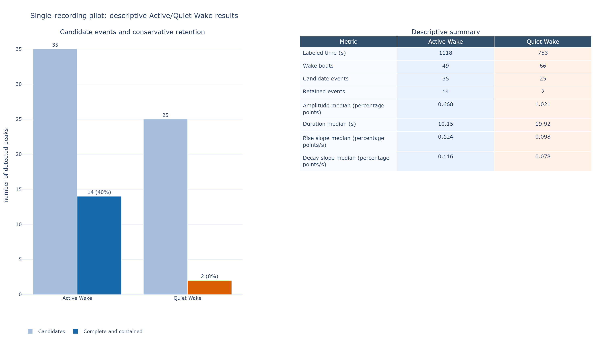
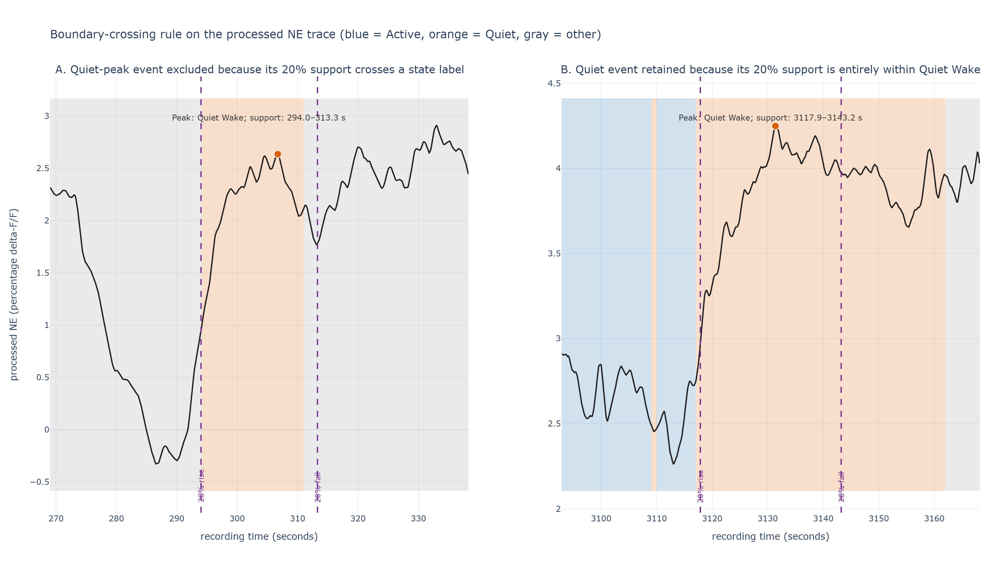
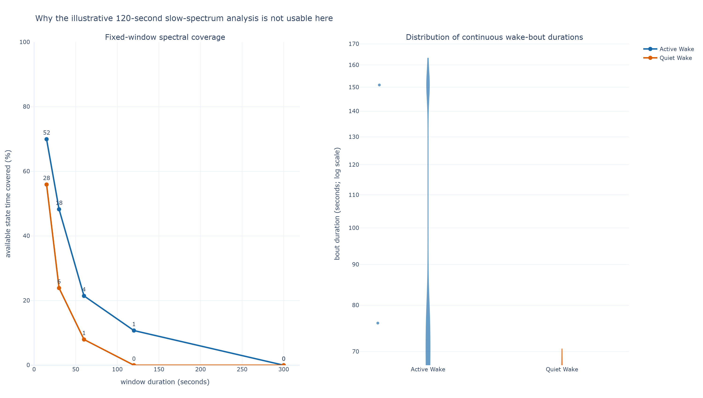

# Preliminary Active/Quiet Wake NE pilot report

**Status:** exploratory single-recording analysis; prepared for PI discussion on
2026-09-15. This demonstrates the pipeline and its decision boundaries, not a
biological comparison or group-level result.

## Scope and input integrity

One MATLAB file, `35_app13_groundtruth.mat`, was processed with final one-second
labels: Active Wake = 4 and Quiet Wake = 5. It contains no mouse, session, condition,
or circadian identifier, so the run is deliberately called `unverified_35`; no
identity was inferred from its filename.

The input passed the technical checks: 10.1725 Hz saved NE rate, 10,299.7 s of finite
NE, 10,300 s of labels, a 0.30 s duration mismatch (within the one-second tolerance),
no coarse Wake labels, and no unscored seconds. The trace is processed percentage
delta-F/F; it was not normalized, smoothed, or rewritten here.

Raw-data review identified a large recording-start excursion: the first saved NE
sample is −99.6 percentage points and recovers over roughly the first second. It is
finite, so the current pipeline does not automatically flag it. It remains untouched;
its upstream cause and any clipping/outlier rule require review on additional
recordings.

## Summary result

The recording contains 1,118 s of Active Wake across 49 bouts and 753 s of Quiet
Wake across 66 bouts. Median bout duration is 14 s for Active Wake and 7 s for Quiet
Wake. The detector finds candidate peaks in both states, but strict containment
retains far fewer Quiet events.

| Descriptive metric | Active Wake | Quiet Wake |
|---|---:|---:|
| Candidate peaks | 35 | 25 |
| Complete, contained peaks used for medians | 14 | 2 |
| Retained fraction | 40% | 8% |
| Amplitude median (percentage points) | 0.668 | 1.021 |
| Duration median (s) | 10.15 | 19.92 |
| 20–80% rise-slope median (percentage points/s) | 0.124 | 0.098 |
| 20–80% decay-slope median (percentage points/s) | 0.116 | 0.078 |



**Interpretation.** The numerical differences are descriptive only. Two retained
Quiet-Wake events cannot support a state contrast, and this one recording has no
verified biological identity or comparison group. Reporting counts beside every
median shows what was measured without making event-level replication look like
mouse-level evidence.

## Why state boundaries are the first decision

An event receives its provisional state from the label at its peak. The primary rule
then keeps it only when the complete 20%-to-20% event support—including samples needed
to interpolate those crossings—falls in that same state. This is a conservative but
defensible default: an event that begins in one state and peaks in another cannot be
unambiguously attributed to either as a pure-state NE signal elevation episode.

In this recording, 15 of 35 Active-peak and 21 of 25 Quiet-peak candidates cross a
state boundary; six Active and two Quiet candidates are incomplete for other
crossing/edge reasons. The retained totals are therefore 14 Active and 2 Quiet.



Figure A makes the rule tangible. The peak is Quiet Wake, but the purple dashed
20%-rise and 20%-fall boundaries span a label transition (background shading: blue
Active, orange Quiet, gray other), so the event is excluded from a *pure* Quiet
summary. Figure B has the same type of peak but its support remains within Quiet
Wake, so it is retained. This prevents mixed-state signal from silently becoming
“Quiet,” at the cost of strongly reduced sample size.

## Spectral feasibility: a data constraint, not a missing calculation

Spectra require equal-length, continuous within-state windows. The pipeline does not
concatenate separate bouts, pad short bouts, or use a different window for each
state, because those changes would manufacture comparability rather than measure it.



The illustrative 120 s / 0.025–0.1 Hz setting has one Active window and **zero**
Quiet windows. At 60 s there are 4 Active and 1 Quiet window; at 30 s, 18 and 6;
at 15 s, 52 and 28. A 15 s window meets the pilot three-cycle criterion only from
0.2 Hz upward, so it cannot answer the illustrated slow-frequency question. We
therefore intentionally report no spectral power or dominant-frequency result until
a common, biologically justified frequency target is chosen.

### Frequency-interpretation guideline

The saved rate (10.17 Hz) gives a 5.09 Hz Nyquist limit, but that is not the useful
physiological range of this processed signal. Upstream, the 1,000-raw-sample moving
average spans about 0.983 s at the expected raw rate and is applied forward and
backward. From that smoothing step alone, estimated power retention is about 94% at
0.1 Hz, 77% at 0.2 Hz, 55% at 0.3 Hz, and 18% at 0.5 Hz. Thus this export is well
suited to slow modulation through roughly 0.2 Hz; interpretation through about
0.3 Hz needs caution, and primary claims above 0.3 Hz need separate validation. This
is a processing guideline, not a universal biological band or an inverse correction.

The stricter limit in this fragmented recording is continuous state coverage. A
common 30 s window can examine 0.1–0.2 Hz only as an exploratory sensitivity (18
Active and 6 Quiet windows); 0.02–0.1 Hz needs longer bouts and is unavailable for
Quiet Wake here. Infraslow NE rhythms near 0.02–0.03 Hz have been reported during
NREM [in one recent study](https://pubmed.ncbi.nlm.nih.gov/41439706), but that does
not establish them as the Active/Quiet target.

## Judgments already made

1. **Keep natural event boundaries.** Amplitude, duration, and slopes use the whole
   detected event; only PSDs use fixed windows.
2. **Use final fine Wake labels.** The analysis accepts final 4/5 labels and rejects
   generic Wake rather than guessing an Active/Quiet subdivision.
3. **Keep crossing candidates visible.** They remain in the audit table and figure;
   they are excluded from contained-event medians rather than deleted.
4. **Do not force a slow spectrum.** Missing Quiet spectral estimates are more honest
   than stitching bouts or changing spectral settings by state.
5. **Preserve potential artifacts.** Raw-data review identified the early −99.6
   recording-start excursion; it is not clipped or removed. A reproducible QC rule
   awaits more files.

## Decisions requested from the PI

The full meeting agenda is [here](pi_meeting_agenda.md). The two highest-priority
decisions are:

1. Should an NE signal elevation episode that crosses a state transition be analyzed only when fully
   contained in one state (current primary rule), or assigned to the state at its peak?
2. What frequency range is scientifically required for the spectral question, and is
   a faster common band acceptable when slow Quiet-Wake windows are unavailable?

## Reproducibility

The raw MAT file and generated CSV outputs are ignored by Git. The committed figures
were rendered from pilot tables with:

```powershell
python scripts/render_preliminary_report_figures.py `
  --analysis outputs/exploratory_35_transients `
  --preflight outputs/exploratory_35_preflight `
  --mat data/35_app13_groundtruth.mat `
  --output docs/assets/preliminary_report
```

Metric definitions and limits are documented in [methods.md](methods.md).
