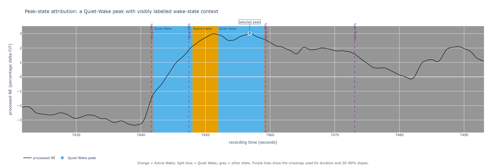
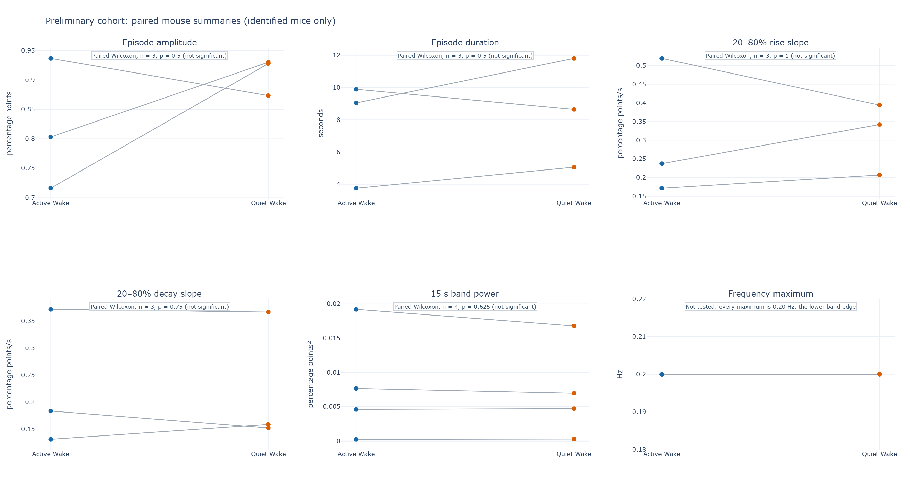
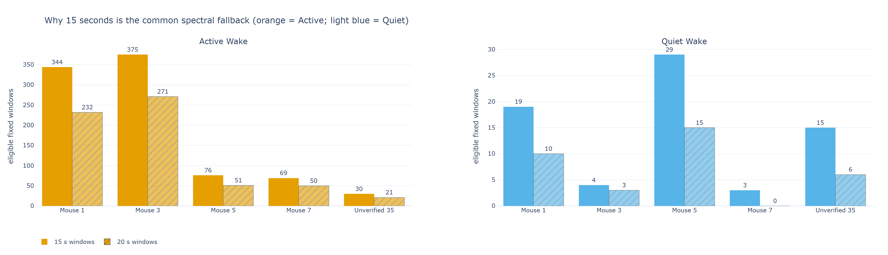

# Preliminary cohort report: NE during Active and Quiet Wake

**Status:** exploratory cohort draft for proposal discussion, 2026-09-16. This
report asks whether processed norepinephrine (NE) signal elevations differ between
Active Wake and Quiet Wake in the recordings currently available. It is intended to
show what the current data can and cannot support, rather than to make a final
biological claim.

Eight analyzable recordings contribute four identified mice. The initial result is
straightforward: none of the measured NE properties differs significantly between
Active Wake and Quiet Wake in this small, paired sample. The short-window spectral
measure is useful as a feasibility check, but cannot resolve a preferred frequency.

## Executive summary

- The analysis preserves the supplied one-second sleep labels and pools repeated
  recordings within each mouse. Events and recordings are not treated as independent
  biological samples.
- The event measurements (amplitude, duration, rising slope, and decay slope) each
  have three complete mouse pairs. The 15-second spectral power measure has four.
  No comparison reached the exploratory two-sided significance threshold of 0.05.
- The frequency maximum is not tested: every mouse's maximum was 0.20 Hz, exactly
  the lower edge of the preselected 0.20–0.30 Hz band. That pattern says the band is
  descending from below 0.20 Hz; it does **not** identify a 0.20 Hz rhythm.
- One file with a 6.25-second mismatch between saved NE and sleep-label duration was
  excluded without trimming either signal. A separate file has no verified mouse
  identity and is retained in source audit/figures but excluded from mouse-paired
  biological testing.

## Summary of results

Each cell gives the median of the mouse-level summaries; the parentheses give the
interquartile range (IQR), the middle half of those mouse values. It gives a compact
view of between-mouse spread, while Figure 1 still shows every mouse. A **mouse pair**
is one Active-Wake summary and one Quiet-Wake summary from the *same* mouse; `n` is
the number of mice with both summaries available for that metric. The reported
p-values use the paired Wilcoxon signed-rank test described in
[Appendix C](#appendix-c-statistical-test-and-interpretation). They are exploratory
and use a two-sided threshold of 0.05.

| NE measure | Active Wake | Quiet Wake | Paired result | p-value / interpretation |
|---|---:|---:|---:|---|
| Episode amplitude (percentage points) | 0.803 (0.760–0.870) | 0.928 (0.901–0.929) | n = 3 | 0.500; not significant |
| Episode duration (s) | 9.05 (6.40–9.47) | 8.65 (6.86–10.23) | n = 3 | 0.500; not significant |
| 20–80% rise slope (percentage points/s) | 0.237 (0.204–0.378) | 0.342 (0.275–0.368) | n = 3 | 1.000; not significant |
| 20–80% decay slope (percentage points/s) | 0.184 (0.157–0.277) | 0.159 (0.155–0.262) | n = 3 | 0.750; not significant |
| 15 s spectral power, 0.20–0.30 Hz (percentage points²) | 0.0061 (0.0035–0.0105) | 0.0058 (0.0036–0.0094) | n = 4 | 0.625; not significant |
| Frequency maximum in that band (Hz) | 0.20 (0.20–0.20) | 0.20 (0.20–0.20) | n = 4 | Not tested; every value is the lower band edge |

The result is not evidence that the two wake states are biologically identical. With
only three or four paired mouse estimates, it is an absence of a reliable difference
in this preliminary cohort.

## Methodology

### Sleep scoring and Active/Quiet Wake labels

The source sleep-scoring workflow first assigns one label per second to broad states.
Seconds already labelled NREM or REM remain unchanged. Coarse Wake is then divided
into **Active Wake** (label 4) and **Quiet Wake** (label 5) from the EMG activity
level. In plain terms, it measures short-time EMG intensity, learns a conservative
activity threshold from the animal's own NREM EMG distribution, and calls above-
threshold Wake seconds Active and the remaining Wake seconds Quiet. Very brief
activity calls are removed so the final labels remain one-second, stable bouts.

This NE analysis only consumes those saved final labels; it does not relabel sleep
stages or change the EMG threshold. The threshold formula and the one-second
implementation details are in [Appendix A](#appendix-a-activequiet-wake-label-details).

### Recordings, grouping, and quality control

The NE input is the saved, processed percentage delta-F/F trace at its recorded
sampling rate. It is not re-smoothed, normalized, interpolated, or inverse-filtered
here. Eight of nine supplied files passed the duration and label contracts. The
invalid file was excluded rather than forced to match the labels.

Repeated recordings were pooled within Mouse 1 and Mouse 3 before comparison; Mouse
5 and Mouse 7 each contribute one valid recording. The file called `unverified_35`
lacks a verified biological identity, so it remains visible in source audits and the
spectral coverage figure but is not a fifth mouse in the statistical test.

Three recordings showed a large, recurrent stored NE excursion immediately at the
recording start. To prevent that unmodified input artifact from driving a result, the
first 15 seconds are marked ineligible for event inclusion and for spectral windows.
The saved data are not deleted or altered, and the rule is applied identically to
both states.

### Assigning an NE elevation episode to wake state

An NE elevation episode must be complete: it must have both a rising and falling
20%-of-amplitude crossing. Following the PI's direction, a complete episode is
assigned to whichever wake state contains its **peak**, even if its shoulders cross
one or more sleep-label boundaries. This avoids discarding most usable short-state
episodes while keeping the boundary crossings available for audit.



The light-blue marker is a Quiet-Wake peak, and the light-blue background explicitly
marks the Quiet-Wake seconds around it. Orange marks Active Wake; gray is another
state. The purple lines show that the episode's 20% and 80% crossings need not all
fall inside the light-blue background, yet the whole complete episode is counted as
Quiet Wake because its peak does. This is a provisional proposal rule, not a claim
that the entire waveform is uniquely caused by that state.

### Local baseline shared by amplitude, duration, and slopes

Before measuring an elevation, the detector estimates the nearby low level of the
same NE trace with a centered 60-second rolling 20th percentile. This is a local,
slowly changing baseline rather than zero or an RMS value. The peak height above that
baseline defines the event's amplitude. The 20% and 80% levels used for duration and
slopes are then fractions of that **baseline-to-peak** height. Thus the baseline is
part of every episode measurement, including rise and decay slopes. The exact
definition and processing order are in [Appendix B](#appendix-b-ne-measurement-details).

Operationally, the baseline is calculated first across each continuous finite NE
stretch, without splitting or resetting it at Active/Quiet Wake boundaries. Peaks are
then detected in that baseline-subtracted trace, and the sleep label at the peak is
looked up afterward. Thus this is not “one peak per wake bout,” and a peak can be a
local maximum of baseline-subtracted NE even when another raw-NE bump elsewhere is
higher. The shared baseline keeps the event definition the same across states, but it
also means its 60-second neighborhood can include other sleep states. That is a
deliberate, reviewable pilot choice.

### NE episode amplitude

For each complete elevation, amplitude is the height of the peak above that local,
slowly varying baseline. It is **not** the absolute value of the NE trace and it is
**not** an RMS measurement. We summarize the median amplitude of all eligible events
within each mouse and state. The local-baseline and exact amplitude definitions are
given in [Appendix B](#appendix-b-ne-measurement-details).

### NE episode duration

Duration is the elapsed time from the rising 20%-of-amplitude crossing to the falling
20% crossing. It is deliberately a broad, reproducible duration measure that is less
sensitive to a noisy peak than a peak-width measure. This 20%-to-20% definition is
currently provisional; the PI's original note also mentioned rising and decay
half-times, which are different measures.

### Rising and decay slopes

The rising slope describes how quickly the central part of an elevation rises: the
amplitude change from 20% to 80%, divided by the time taken. The decay slope applies
the same idea to the falling side and is reported as a positive magnitude, so larger
values mean a faster fall. These are **20–80% secant slopes**, not half-times
(T₁/₂). The distinction and exact definitions are in [Appendix B](#appendix-b-ne-measurement-details).

### Short-window spectral power and frequency maximum

Power spectra need equal-duration data segments. We therefore extract non-overlapping
15-second intervals wholly within a single wake state, after the 15-second
recording-start exclusion, and average their spectra within each mouse/state. The
common available band is 0.20–0.30 Hz. We report the total power in that narrow band
and the frequency bin with the largest power.

This measurement is intentionally separate from natural-duration elevation episodes.
The 0.20–0.30 Hz band is the narrow overlap left by two constraints. At the low end,
the three-cycle adequacy rule requires 15 seconds to assess 0.20 Hz. Going lower
would require longer windows (for example, 20 seconds for 0.15 Hz), but Mouse 7 has
no Quiet-Wake window that long; separate bouts are never joined to manufacture one.
At the high end, upstream forward-and-backward near-one-second smoothing increasingly
attenuates the stored signal above about 0.30 Hz. The later downsampling preserves a
mathematical Nyquist limit near 5 Hz, but it cannot restore fast information removed
by smoothing or recover the original high-rate waveform. The smoothing calculation
and retained-power table are in [Appendix B](#appendix-b-ne-measurement-details).

Fifteen seconds was therefore chosen because it is the only common state-pure setting
that retains Quiet-Wake coverage for every identified mouse. It supports a
high-frequency feasibility check, not a resolved slow-rhythm analysis. The coverage
and result are shown separately below.

## Results

### Paired mouse summaries

None of the four elevation measures or the narrow-band power measure showed a
statistically significant Active-versus-Quiet Wake difference. Figure 1 shows every
paired mouse estimate rather than hiding the small sample behind a bar chart. Mouse 7
has valid spectral windows but no detected complete elevations under the provisional
event definition, so it is absent from the event-measure panels and contributes only
to the spectral comparison.



**Figure 1.** Each line connects the same identified mouse across wake states.
P-values are two-sided paired Wilcoxon results; see
[Appendix C](#appendix-c-statistical-test-and-interpretation). No panel reaches the
exploratory 0.05 threshold. The frequency panel is labelled “not tested” because all
maxima are the lower band edge, not because it has established equality.

### Spectral result

The available window counts confirm the methodological constraint: Mouse 7 contributes
three Quiet-Wake windows at 15 seconds and none at 20 seconds. A longer-window
spectrum cannot be rescued by joining separate bouts, because that would cross state
transitions and answer a different question.



**Figure 2.** Number of eligible fixed windows after the recording-start QC rule.
Orange denotes Active Wake and light blue Quiet Wake; bar fill distinguishes the
15- and 20-second alternatives. The labelled `Unverified 35` file is included to
document available source data, not as an independently identified mouse. The
15-second choice produces a 0.20–0.30 Hz band, but every maximum in that band is at
0.20 Hz. Thus, no preferred-frequency result should be presented.

## Interpretation for the proposal

The positive result is feasibility: the available sleep labels can be consumed without
relabeling, complete NE elevations can be audited and peak-assigned, and the cohort
supports paired mouse-level summaries. The biological comparison itself is currently
negative and underpowered: no measured property provides a reliable Active-versus-
Quiet Wake difference.

The clearest next scientific steps are to verify the identity of `unverified_35`,
resolve the duration/T₁/₂ versus 20–80%-slope definition with the PI, and obtain
longer uninterrupted Quiet-Wake bouts or a less-slow NE reference trace if slow or
phasic frequency content is central to the question. These are design and data
limitations, not problems that should be hidden by pooling files as independent mice
or by extending/bridging wake bouts.

## Appendix A: Active/Quiet Wake label details

The upstream detector calculates EMG root-mean-square (RMS) activity on the 20 Hz
EMG grid, aggregates it to one-second Wake labels, and anchors its threshold to NREM
in the same recording. Its current pilot threshold is the NREM RMS 75th percentile
plus two robust standard deviations estimated from the median absolute deviation
(MAD):

```text
threshold = NREM_RMS_75th_percentile + 2 × 1.4826 × MAD(NREM_RMS)
```

A coarse-Wake second is Active Wake when its activity meets this threshold; otherwise
it is Quiet Wake. Runs shorter than one second do not survive as a distinct activity
bout. This is a documented upstream pilot setting that needs behavioral/video
validation; it is not re-estimated by the NE pipeline.

## Appendix B: NE measurement details

### Local baseline and episode geometry

Let `x(t)` be the processed percentage delta-F/F trace. The detector estimates a
time-varying local baseline `b(t)` as the centered 60-second rolling 20th percentile
of `x(t)`, then works with the baseline-subtracted trace `y(t) = x(t) - b(t)`. It
requires at least 0.5 percentage points of prominence between a candidate peak and
its local baseline. For a peak at `t_peak`, amplitude is `A = y(t_peak)`. The
detector linearly locates the four times at which `y(t)` crosses 20% and 80% of `A`
on the rising and falling sides: `t_r20`, `t_r80`, `t_d80`, and `t_d20`.

The implementation runs this sequence independently on each continuous finite NE
stretch: (1) compute `b(t)` across the whole stretch, using roughly 30 seconds on
either side of an interior sample; (2) compute `y(t)`; (3) identify local maxima in
`y(t)`; and only then (4) assign the peak's saved sleep label. The rolling baseline
is not recomputed within Active or Quiet Wake, and it is not reset at a state boundary.
At the finite stretch's ends, nearest available values extend the rolling operation.
This offline centered operation intentionally uses neighboring time on both sides; it
is not a causal real-time baseline.

```text
amplitude       = peak - local baseline
duration        = t_d20 - t_r20
rise slope      = 0.60 × amplitude / (t_r80 - t_r20)
decay slope     = 0.60 × amplitude / (t_d20 - t_d80)
```

The duration includes the broad lower portions of the elevation; the slopes use only
the central 20–80% portion. A T₁/₂ would instead report a time associated with 50%
amplitude, so it should not be substituted for either slope without a new explicit
definition.

The 60-second width and 20th percentile are **provisional detector settings**, not a
literature-derived laboratory standard and not values calibrated against ground truth
in this cohort. They were chosen as an inspectable starting point: 60 seconds is much
slower than the seconds-to-tens-of-seconds elevations under study, and the 20th
percentile estimates a local lower envelope that sustained elevations should not pull
up as strongly as a mean or median. The team should review representative traces and
run a declared sensitivity analysis before treating either number as final.

### Spectral window and preprocessing limit

For spectra, each eligible 15-second state-pure interval receives a periodogram. The
within-mouse/state spectrum is a window-count-weighted mean, and band power is the
integral from 0.20 to 0.30 Hz. The frequency maximum is simply the highest spectral
bin inside that same interval. Frequency resolution is approximately `1 / 15 = 0.067`
Hz. The three-cycle pilot rule sets the lower feasible frequency to `3 / T`, where
`T` is the window duration: 0.20 Hz for 15 seconds and 0.15 Hz for 20 seconds.

The stored NE trace was smoothed upstream using a 1,000-sample moving average at an
expected raw rate of approximately 1,017.25 Hz, so one pass spans about 0.983 s. The
smoother is applied forward and backward. If `N` is 1,000 and `F_raw` is the expected
raw sampling rate, the moving-average magnitude of one pass is:

```text
G(f) = sinc(N × f / F_raw) / sinc(f / F_raw)
power retained after forward-and-backward smoothing = G(f)^4
```

The fourth power occurs because forward-and-backward filtering squares the amplitude
magnitude, and power is amplitude squared. This diagnostic describes the smoothing
step alone; it does not model sensor kinetics, control fitting, aliasing, or the rest
of the acquisition chain, and no inverse correction is applied.

| Frequency | Estimated power retained after smoothing |
|---:|---:|
| 0.10 Hz | 94% |
| 0.20 Hz | 77% |
| 0.30 Hz | 55% |
| 0.50 Hz | 18% |
| 1.00 Hz | approximately 0% |

The factor-100 downsampling produces the roughly 10.17 Hz saved rate and removes
access to the original high-rate waveform. Its Nyquist limit is still about 5.09 Hz,
so Nyquist is not the reason for the 0.30 Hz ceiling. Rather, the strong smoothing
attenuation makes higher-frequency interpretation progressively less meaningful, and
downsampling cannot recover what that legacy smoothing removed.

Together, the short Quiet-Wake bouts set the low boundary and legacy smoothing sets
the cautious high boundary. The resulting 0.20–0.30 Hz measure is a constrained
feasibility measure, not a full frequency characterization.

## Appendix C: Statistical test and interpretation

Each statistical comparison begins with one summary per mouse in Active Wake and one
in Quiet Wake. Together, those two values form a **mouse pair** because they come
from the same animal; the test asks whether each mouse tends to be higher in one state
than in the other. We use a two-sided **Wilcoxon signed-rank test**, a nonparametric
paired test that asks whether the ranked within-mouse differences are consistently
above or below zero. It is appropriate here because the sample is very small and we
should not assume the differences follow a normal distribution.

The p-value is the probability, under a no-systematic-difference model, of observing
differences at least as incompatible with zero as these. A p-value below 0.05 would
be called statistically significant in this exploratory report. A p-value above 0.05
does not demonstrate equivalence or absence of biology; it means the current paired
data did not establish a reliable difference. Frequency maximum was not tested because
all paired differences were zero for a methodological reason: the maximum landed on
the lower edge of the search band in every case.

No event or spectral window is used as an independent mouse. The unverified file is
not included in the tests, and a mouse without events in one state has no event-metric
pair. These choices reduce apparent sample size, but avoid pseudoreplication and
overstated confidence.

## Reproducibility

The report figures were generated from the QC'd peak-state output with:

```powershell
python scripts/render_cohort_preliminary_report_figures.py `
  --analysis outputs/proposal_cohort_20260916_startqc_peak15 `
  --preflight outputs/proposal_cohort_20260916_startqc_preflight `
  --mat data/35_app13_groundtruth.mat `
  --peak-example-seed 20260916 `
  --output docs/assets/cohort_preliminary_report
```

The output directory must be new or empty when rendering, which prevents silently
mixing figures from different analysis runs. The seed chooses deterministically among
complete, non-start-QC-excluded Quiet-Wake peak events that display at least 10 seconds
of Quiet Wake and 4 seconds of Active Wake, and whose selected point is no more than
0.05 percentage points below the largest NE value in the plotted context. This makes
the labelled point a clear, visually defensible local peak while showing both wake
states.
