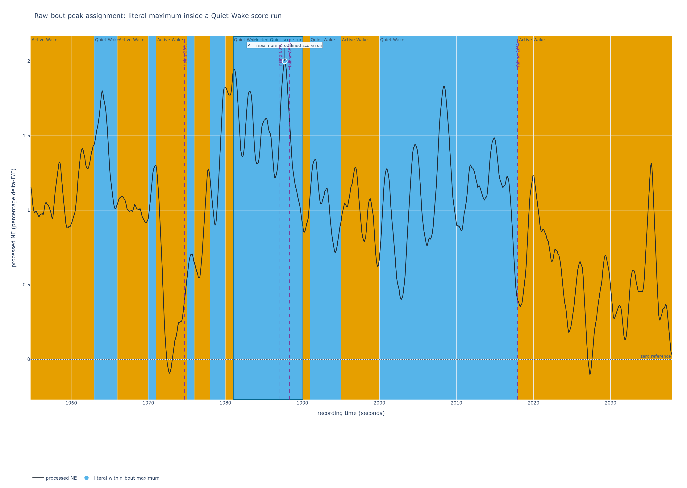
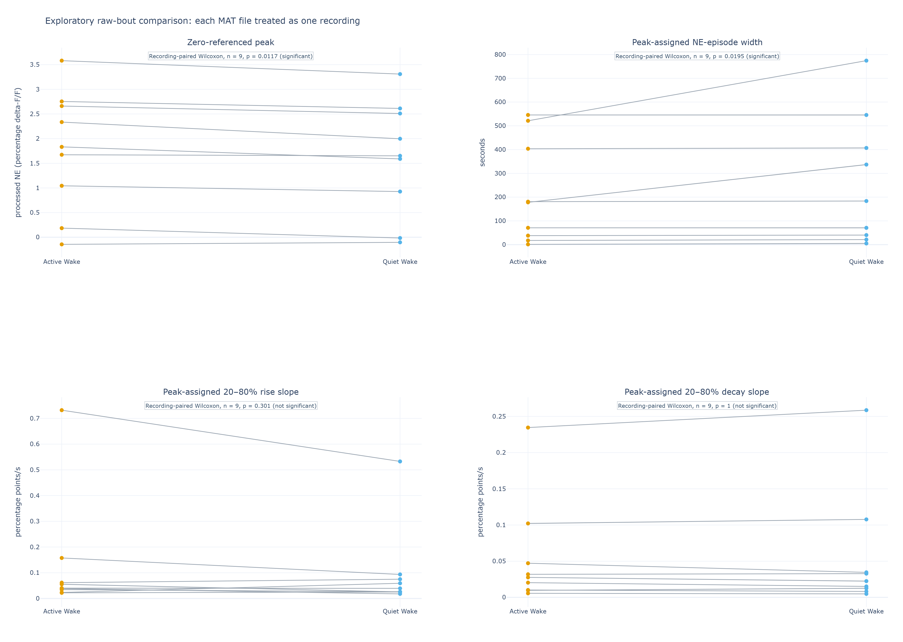
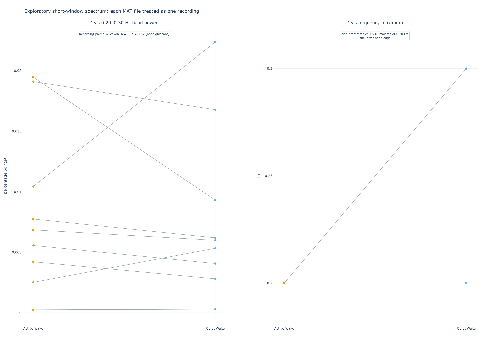
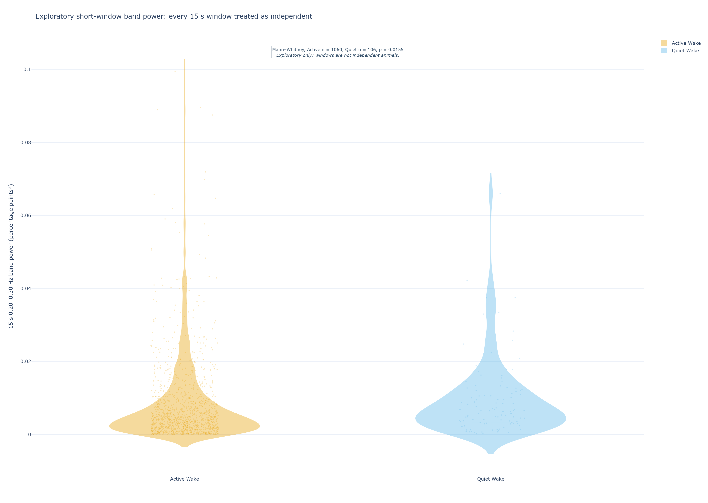
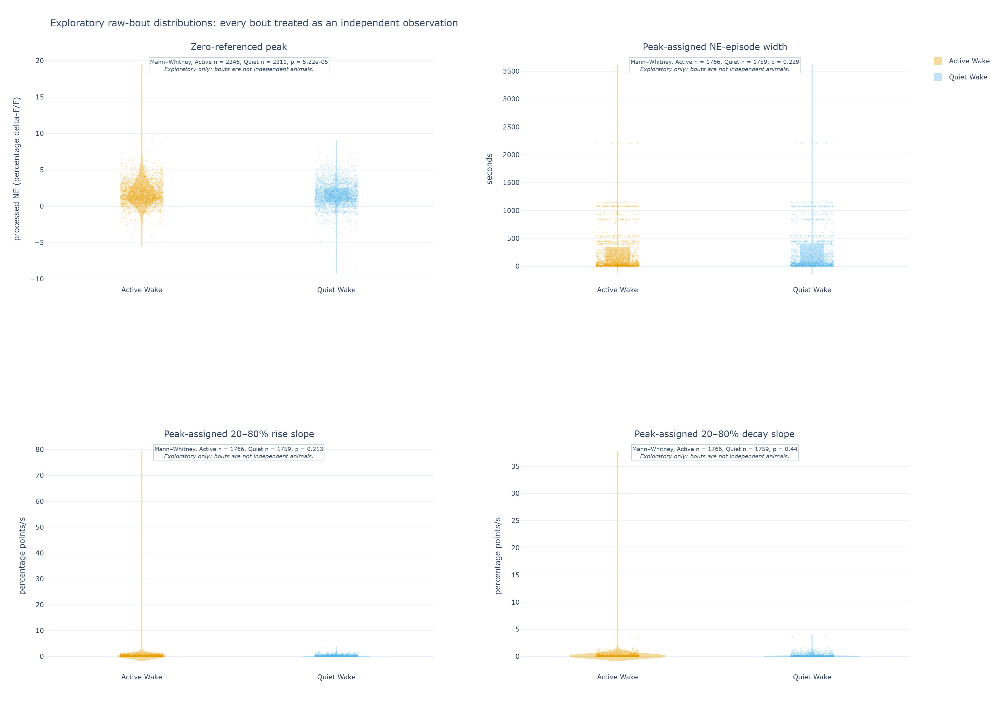

# Preliminary raw-bout recording comparison: NE during Active and Quiet Wake

**Status:** deliberately exploratory sensitivity analysis, 2026-09-16. This is a
self-contained companion to the local-baseline cohort report. It asks a simpler,
literal question of the already processed NE percentage delta-F/F trace: how high is
the signal within each labelled Active- or Quiet-Wake bout? It does not create a new
local baseline.

## Executive summary

- All nine available MAT files contribute to this screen. The final 6.25 seconds of
  unlabelled NE in one file are outside the state comparison; no input was edited or
  shifted.
- With one median per state per file, zero-referenced peak NE is higher in Active
  Wake (paired Wilcoxon p = 0.0117). Peak-assigned NE-episode width also differs
  nominally (p = 0.0195); 20–80% rise and decay slopes do not. These are
  **recording-level screening results**, not independent-mouse evidence.
- As a deliberately more permissive description, treating every eligible Wake bout
  as an independent observation gives a nominal Active/Quiet peak difference
  (Mann–Whitney p = 5.22 × 10⁻⁵). That calculation is **pseudoreplicated**: bouts
  within a recording, and recordings from the same mouse, are correlated. It must
  not be used to claim a biological state effect.
- The corresponding 15-second spectral analysis likewise gives no nominal
  recording-level band-power difference (paired Wilcoxon p = 0.570). Treating its
  1,060 Active and 106 Quiet windows as independent gives a nominal difference
  (Mann–Whitney p = 0.0155), but that is also pseudoreplicated and non-inferential.
- The score-label geometry and the NE measurement are kept distinct below. Peak-state
  assignment intentionally allows 20%/80% support to cross score boundaries: width
  and slopes describe the full NE elevation around the labelled peak, not the duration
  of that peak's sleep-score run.

## Summary of results

Values are median (interquartile range). The first table summarizes one median per
state per MAT file, then compares those matched recording summaries. Orange denotes
Active Wake and light blue Quiet Wake. The paired Wilcoxon test and its
recording-independence caveat are explained in [Appendix C](#appendix-c-statistical-test-and-interpretation).

| Reported measure | Active Wake | Quiet Wake | Recording pairs | p-value / interpretation |
|---|---:|---:|---:|---|
| Peak processed NE (percentage delta-F/F) | 1.833 (1.044–2.661) | 1.651 (0.927–2.510) | n = 9 | 0.0117; nominal recording-level signal |
| **Sleep-score bout duration (s)** | **5 (4–7)** | **2 (1.5–2)** | n = 9 | 0.00391; actual file-median score-run duration, exploratory |
| Peak-assigned 20–80% NE rise slope (percentage points/s) | 0.040 (0.035–0.062) | 0.039 (0.026–0.075) | n = 9 | 0.301; contextual peak-state screen |
| Peak-assigned 20–80% NE decay slope (percentage points/s) | 0.028 (0.010–0.047) | 0.022 (0.013–0.035) | n = 9 | 1.000; contextual peak-state screen |

The next table deliberately discards the recording grouping and treats every eligible
bout or score run as a separate observation. It is included to show the distributional
signal, not to inflate confidence. Its Mann–Whitney p-values are **nominal only**; see
[Appendix C](#mannwhitney-tests-for-the-independent-bout-and-independent-window-descriptions).

| Reported measure | Active Wake | Quiet Wake | Active observations | Quiet observations | Nominal Mann–Whitney p-value |
|---|---:|---:|---:|---:|---:|
| Peak processed NE (percentage delta-F/F) | 1.583 (0.812–2.750) | 1.452 (0.630–2.510) | 2,246 | 2,311 | 5.22 × 10⁻⁵ |
| **Sleep-score bout duration (s)** | **4 (2–10)** | **2 (1–4)** | 2,247 | 2,312 | 1.82 × 10⁻¹¹² |
| Peak-assigned 20–80% NE rise slope (percentage points/s) | 0.061 (0.012–0.338) | 0.058 (0.012–0.301) | 1,766 | 1,759 | 0.213 |
| Peak-assigned 20–80% NE decay slope (percentage points/s) | 0.039 (0.009–0.126) | 0.036 (0.009–0.127) | 1,766 | 1,759 | 0.440 |

### Score-label geometry (not an NE measurement)

This is the actual sleep-score bout duration requested by the score visualization;
the peak-assigned NE-episode width remains an audit measurement rather than a
reported duration result.

| Actual maximal score-run measure | Active Wake | Quiet Wake | Interpretation |
|---|---:|---:|---|
| Labelled time (s) | 26,532 | 8,626 | Quiet is 24.5% of labelled Wake time |
| Number of score runs | 2,247 | 2,312 | Similar counts reflect fragmentation, not comparable time |
| **Pooled score-bout duration (s)** | **4 (2–10)** | **2 (1–4)** | Actual one-second-label run duration |
| File-median score-bout duration (s) | 5 (4–7) | 2 (1.5–2) | n = 9 paired files; Wilcoxon p = 0.00391, exploratory |

Thus Quiet Wake has a near-balanced raw run count but is materially shorter and less
prevalent in time; 81.6% of Quiet and 59.7% of Active score runs are at most 5 s.

The short-window spectrum is calculated separately using the same recording-level
and deliberately independent-observation hierarchy. It uses all nine files, their
common labelled interval, and no recording-start exclusion. Band power is the mean
per-window spectrum within each state and file; frequency maximum is its largest
bin in the 0.20–0.30 Hz band.

| Short-window spectral measure | Active Wake | Quiet Wake | Recording pairs | p-value / interpretation |
|---|---:|---:|---:|---|
| 15 s 0.20–0.30 Hz band power (percentage points²) | 0.00685 (0.00422–0.01044) | 0.00599 (0.00407–0.00931) | n = 9 | 0.570; not significant |
| 15 s frequency maximum (Hz) | 0.20 (0.20–0.20) | 0.20 (0.20–0.20) | n = 9 | 1.000; not interpretable: 17 of 18 values are at the 0.20 Hz lower edge |

| Short-window spectral measure | Active Wake | Quiet Wake | Active windows | Quiet windows | Nominal Mann–Whitney p-value |
|---|---:|---:|---:|---:|---:|
| 15 s 0.20–0.30 Hz band power (percentage points²) | 0.00479 (0.00200–0.01038) | 0.00653 (0.00338–0.01207) | 1,060 | 106 | 0.0155 |

## Methodology

### Sleep scoring and Active/Quiet Wake labels

The analysis reads the supplied final one-second sleep scores without changing them:
4 is Active Wake and 5 is Quiet Wake. The labels are generated upstream from scored
Wake using an EMG activity measure, not from the NE trace. In brief, the upstream
method uses a centred 0.5-second EMG RMS envelope sampled at 20 Hz, anchors a
recording-specific threshold to NREM EMG, then assigns each one-second Wake label by
its within-second activity occupancy. This pilot labeler is an EMG-based proxy for
Wake activity and still requires biological validation. Details are in
[Appendix A](#appendix-a-activequiet-wake-label-details).

### Recordings, grouping, and quality control

The primary unit in the first analysis is a MAT file. Each file supplies one Active
and one Quiet median across its eligible bouts, and those two values remain paired.
For this preliminary sensitivity screen only, the nine files are provisionally
treated as separate records even though some may come from the same mouse. That
assumption improves visibility during proposal development but prevents mouse-level
inference.

Analysis starts at the shared saved start and ends when either the NE signal or the
label vector ends. This common-start, minimum-duration rule retains the file whose
NE trace is 6.25 seconds longer: its labelled interval is analyzed and its unlabelled
tail is not. No trace is concatenated across invalid samples, and no labels or NE
values are rewritten. Unlike the local-baseline cohort report, this sensitivity keeps
all labelled common-start bouts, including known recording-start excursions.

### Measuring a zero-referenced peak in each scored bout

This sensitivity intentionally uses **no new rolling local baseline**. Its reference
is the existing zero of the processed percentage delta-F/F trace, after upstream
control fitting, smoothing, and downsampling. The analysis therefore asks whether
literal processed values differ across labelled Wake bouts. This differs from the
local-baseline report, which estimates a rolling 20th-percentile baseline across the
continuous recording before detecting elevations. The two definitions are useful
comparisons, not interchangeable estimates.



**Figure 1.** Raw-bout peak assignment. The outlined light-blue score run supplies
its own selected peak: `P` is the largest stored processed-NE value within that run.
There is no rolling baseline, prominence threshold, or local-peak detector in this
workflow. Purple lines mark 20%/80% crossings relative to literal `P`; they may cross
score boundaries because the state is assigned by the peak. This is intentionally
different from the rolling-baseline event detector illustrated in the cohort report.

### NE episode amplitude

For each finite single-state bout, amplitude is the largest stored processed NE value
in that bout. It is neither raw fluorescence nor an RMS measurement. It is a
zero-referenced percentage delta-F/F peak and retains any residual slow drift that
survived upstream processing.

### Peak-assigned NE-episode width and slopes

For a positive peak, the NE-episode width is the time from its nearest rising 20%
crossing to its nearest falling 20% crossing, both relative to the literal peak. The
20–80% rise and decay slopes are positive secants through the central portion of that
same full NE elevation. A missing crossing yields a missing timing measurement rather
than a manufactured boundary.

As specified for this peak-state screen, the crossings are found in the surrounding
continuous finite NE trace and may leave the peak's score run. This is allowed: the
peak determines Active/Quiet assignment. Accordingly, width and slopes are
peak-assigned contextual NE metrics, **not** sleep-score-bout durations.

### Short-window spectral power and frequency maximum

This report recalculates the 15-second, 0.20–0.30 Hz spectrum under its own stated
assumptions, rather than copying the cohort result. Each MAT file is limited to its
common labelled interval, with no recording-start exclusion, and contributes separate
non-overlapping, state-pure 15-second windows. Within a file and state, those windows
are averaged into one spectrum; its band power and largest in-band frequency are the
recording-level measures. The nine Active/Quiet recording pairs are then compared by
paired Wilcoxon test.

As an additional descriptive screen, every individual 15-second window is treated as
an independent observation and compared with Mann–Whitney. That extra assumption is
knowingly false: windows from the same recording, and recordings from the same mouse,
are correlated. It is shown to expose the distribution and the large imbalance in
available state windows, not to increase inferential confidence. Details and the
frequency-limit rationale are in [Appendix B](#spectral-window-and-preprocessing-limit).

## Results

### Paired recording summaries

For this document, the paired summaries are **recording pairs**, not mouse pairs:
each point in Figure 1 is a file-level median across bouts, and a line joins its two
state values. The zero-referenced peak and the peak-assigned NE-episode width have
nominal paired p-values below 0.05. They remain exploratory because the nine file
pairs are only a temporary proxy for independent animals.



**Figure 2.** File-level median raw-bout metrics. Orange is Active Wake; light blue
is Quiet Wake. All panels contain nine recording pairs. Width and slopes are assigned
by the state at the NE peak; their crossings may span other score states by design.

### Spectral result

The nine recording-pair screen shows no nominal difference in 0.20–0.30 Hz band
power (p = 0.570). Frequency maximum is not biologically interpretable: 17 of 18
recording/state values select 0.20 Hz, the lower edge of the search band; the single
remaining value is 0.30 Hz. The paired p = 1.000 should not be read as evidence that
frequency is the same—this edge-locking means the narrow band has not resolved a
dominant oscillation.



**Figure 3.** One averaged short-window spectrum per state per MAT file. Orange is
Active Wake; light blue is Quiet Wake. The apparent frequency maximum clustering at
the lower band edge is a feasibility limitation, not a resolved biological frequency.

Treating each spectral window as independent produces a nominal band-power difference
(Mann–Whitney p = 0.0155), with a higher Quiet-Wake median. It is explicitly
pseudoreplicated: 1,060 Active windows and 106 Quiet windows come from only nine
files, and the samples are highly correlated within recordings. It cannot overturn or
replace the paired recording-level result.



**Figure 4.** Every 15-second state-pure spectral window. The point/violin display
shows the window-count imbalance and is marked as an exploratory, non-independent
description.

### Independent-bout exploratory description

Figure 5 displays every eligible scored-bout peak and uses a two-sided Mann–Whitney
calculation only as a distributional screen. The peak distributions have a nominal
difference; the peak-assigned width and slope distributions do not. The figure makes
the large apparent sample size visible, but it must not be interpreted as thousands
of independent animals or experimental replicates. Bouts share neural state,
recording context, preprocessing, and often the same mouse.



**Figure 5.** Every eligible bout is shown as a faint point, with a violin and box
summary. The fixed random seed controls horizontal jitter only. Mann–Whitney labels
are deliberately marked exploratory because bout independence is knowingly false.

## Interpretation for the proposal

This sensitivity provides a simple, visible signal: literal processed NE peaks
selected from Active-Wake-labelled bouts tend to be higher whether the screen is
summarized by file or by bout.
The recording-paired result is the more defensible of the two within this report,
because it retains the Active/Quiet pairing inside a file. Neither result establishes
an independent-mouse state effect. The bout-level display is useful for diagnosing
where a possible effect resides and for planning future hierarchical analysis, not
for increasing statistical confidence.

The local-baseline and zero-referenced reports answer different questions. The first
is resistant to slow recording drift; the second is the literal processed-level
comparison. Their spectra also use different inclusion and grouping rules, so their
spectral p-values are not interchangeable. Future datasets need verified
mouse/session identifiers and a predeclared mouse-level or hierarchical analysis
before either can support a final biological conclusion.

## Appendix A: Active/Quiet Wake label details

Upstream, raw EMG is detrended, zero-phase band-pass filtered, and converted to a
centred 0.5-second RMS envelope on a 20 Hz grid. Automatic labeling uses a
recording-specific threshold of the NREM 75th-percentile RMS plus two robust standard
deviations, where robust standard deviation is 1.4826 times the NREM median absolute
deviation. Candidate active intervals may bridge dips up to 0.5 seconds and must last
at least one second. A one-second Wake label is Active when at least ten of its twenty
RMS values fall in an active interval; otherwise it is Quiet. The final result passed
to this analysis is still only one label per second, and is never relabelled here.

## Appendix B: Peak-assigned NE geometry, spectral window, and preprocessing limit

### Peak-assigned NE geometry

Let `x(t)` be the stored processed percentage delta-F/F trace and let `P` be its
literal maximum in one finite, single-state Wake bout. There is no new baseline
subtraction. When `P > 0`, find the nearest rising and falling crossings in the
continuous finite trace at `0.2P` and `0.8P`, denoted `t_r20`, `t_r80`, `t_d80`, and
`t_d20`. The bout containing `P` determines the state; as specified by peak-state
assignment, the support may cross a score-state boundary but never an invalid NE gap.

```text
zero-referenced peak       = P
NE-episode width           = t_d20 - t_r20
rise slope                 = 0.60 × P / (t_r80 - t_r20)
decay slope                = 0.60 × P / (t_d20 - t_d80)
```

The formulas measure the full elevation associated with its labelled peak and are not
equivalent to a sleep-score-bout duration. In this run, 1,624 of 1,766 complete
Active-peak supports and 1,696 of 1,759 Quiet-peak supports cross at least one score
boundary; that high rate is expected under the allowed peak-state rule and must stay
visible when interpreting the contextual width and slopes.

### Spectral window and preprocessing limit

The raw-report spectral screen uses non-overlapping, state-pure 15-second windows
from the common labelled interval of every MAT file, including `mouse5_day1.mat`.
It does not exclude the first 15 seconds. A Hann-window periodogram is calculated for
each window, and each file/state spectrum is the mean of its available windows. The
0.20–0.30 Hz band power is the area under that mean spectrum, while frequency maximum
is its highest bin. A 15-second window has approximately 0.067 Hz resolution and the
pilot three-cycle rule makes 0.20 Hz the lowest feasible frequency. This run has
1,060 Active and 106 Quiet usable windows, so the independent-window display is also
strongly unbalanced.

The saved NE trace was smoothed upstream with a 1,000-sample moving average at an
expected raw rate of about 1,017.25 Hz, or about 0.983 seconds per pass, then filtered
forward and backward and downsampled by 100. The smoothing-only retained power is
approximately 94% at 0.10 Hz, 77% at 0.20 Hz, 55% at 0.30 Hz, and 18% at 0.50 Hz.
Thus the saved-rate Nyquist limit is not the meaningful ceiling: smoothing makes
claims above 0.30 Hz progressively less interpretable. These preprocessing and
coverage constraints do not change the raw-bout comparisons above.

## Appendix C: Statistical test and interpretation

### Wilcoxon signed-rank test for recording pairs

The recording-level table starts with one Active and one Quiet median per MAT file.
These values are naturally paired because they come from the same recording. A
two-sided Wilcoxon signed-rank test asks whether the ranked within-recording
differences consistently favor one state without assuming that those differences are
normally distributed. It is an appropriate **paired** test for this small
recording-level screen if the nine recording pairs are provisionally treated as
independent.

That final condition is the important limitation: repeated recordings from the same
mouse may not be independent. Thus a paired Wilcoxon p-value below 0.05 is a nominal
screening result, not a confirmatory mouse-level finding. A p-value above 0.05 does
not demonstrate equivalence or absence of biology.

### Mann–Whitney tests for the independent-bout and independent-window descriptions

The independent-bout and independent-window tables compare all Active and Quiet
values with two-sided Mann–Whitney U tests. This nonparametric unpaired rank test is
the usual test for two independent samples. It is useful here only to calculate and
display shifts between the two **observed bout or window distributions**.

Its independence assumption is knowingly violated: multiple bouts and spectral
windows come from the same recording, and multiple recordings may come from the same
mouse. Consequently, its p-values cannot be interpreted as biological inferential
p-values, regardless of how small they are. The tables and plots are retained as
explicitly pseudoreplicated exploratory descriptions. A future mouse/session-aware
mixed or hierarchical model would be required for inferential use of all bouts or
windows.

## Reproducibility

The raw-bout tables and figures were generated with:

```powershell
python scripts/analyze_raw_bouts.py `
  --input-dir data `
  --output outputs/raw_bout_recording_comparison_20260916_peak_assigned

python scripts/render_raw_bout_report_figures.py `
  --analysis outputs/raw_bout_recording_comparison_20260916_peak_assigned `
  --output docs/assets/raw_bout_recording_comparison_peak_assigned_v2
```

The analysis writes `score_label_bouts.csv` and `score_label_geometry.csv` audits in
addition to per-bout peak-assigned NE measurements, spectral-window tables,
recording-level summaries, paired Wilcoxon results, and independent-bout/window
Mann–Whitney results. Figures 4 and 5 use seed `20260916` for horizontal jitter; the
seed does not select or alter observations. Output directories must be new or empty,
preventing accidental mixing of results from different input sets.
