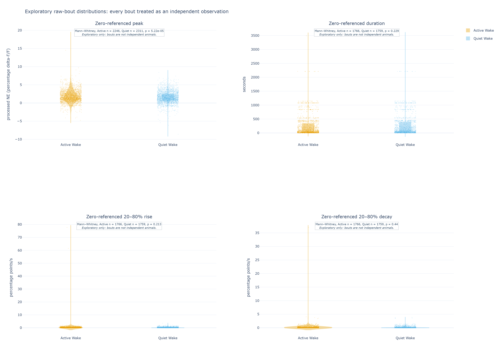

# Preliminary raw-bout recording comparison: NE during Active and Quiet Wake

**Status:** deliberately exploratory sensitivity analysis, 2026-09-16. This is a
self-contained companion to the local-baseline cohort report. It asks a simpler,
literal question of the already processed NE percentage delta-F/F trace: how high is
the signal within each labelled Active- or Quiet-Wake bout? It does not create a new
local baseline.

## Executive summary

- All nine available MAT files contribute to this screen. The final 6.25 seconds of
  unlabelled NE in one file are outside the state comparison; no input was edited or
  shifted.
- With one median per state per file, zero-referenced peak NE is higher in Active
  Wake (paired Wilcoxon p = 0.0117). Duration also differs nominally (p = 0.0195);
  20–80% rise and decay slopes do not. These are **recording-level screening
  results**, not independent-mouse evidence.
- As a deliberately more permissive description, treating every eligible Wake bout
  as an independent observation gives a nominal Active/Quiet peak difference
  (Mann–Whitney p = 5.22 × 10⁻⁵). That calculation is **pseudoreplicated**: bouts
  within a recording, and recordings from the same mouse, are correlated. It must
  not be used to claim a biological state effect.
- Peak state is determined by the bout containing the peak. Its 20% and 80%
  crossings may occur outside the bout and across wake-state boundaries, as agreed
  for the primary peak-state analysis. Timing measures are therefore contextual,
  not pure within-state kinetics.

## Summary of results

Values are median (interquartile range). The first table summarizes one median per
state per MAT file, then compares those matched recording summaries. Orange denotes
Active Wake and light blue Quiet Wake. The paired Wilcoxon test and its
recording-independence caveat are explained in [Appendix C](#appendix-c-statistical-test-and-interpretation).

| Zero-referenced measure | Active Wake | Quiet Wake | Recording pairs | p-value / interpretation |
|---|---:|---:|---:|---|
| Peak processed NE (percentage delta-F/F) | 1.833 (1.044–2.661) | 1.651 (0.927–2.510) | n = 9 | 0.0117; nominal recording-level signal |
| Duration (s) | 177.92 (37.94–403.57) | 183.52 (40.23–406.87) | n = 9 | 0.0195; nominal recording-level difference |
| 20–80% rise slope (percentage points/s) | 0.040 (0.035–0.062) | 0.039 (0.026–0.075) | n = 9 | 0.301; not significant |
| 20–80% decay slope (percentage points/s) | 0.028 (0.010–0.047) | 0.022 (0.013–0.035) | n = 9 | 1.000; not significant |

The next table deliberately discards the recording grouping and treats every eligible
bout as a separate observation. It is included to show the distributional signal,
not to inflate confidence. Its Mann–Whitney p-values are **nominal only**; see
[Appendix C](#mannwhitney-test-for-the-independent-bout-description).

| Zero-referenced measure | Active Wake | Quiet Wake | Active bouts | Quiet bouts | Nominal Mann–Whitney p-value |
|---|---:|---:|---:|---:|---:|
| Peak processed NE (percentage delta-F/F) | 1.583 (0.812–2.750) | 1.452 (0.630–2.510) | 2,246 | 2,311 | 5.22 × 10⁻⁵ |
| Duration (s) | 72.50 (18.23–342.98) | 78.28 (22.91–387.07) | 1,766 | 1,759 | 0.229 |
| 20–80% rise slope (percentage points/s) | 0.061 (0.012–0.338) | 0.058 (0.012–0.301) | 1,766 | 1,759 | 0.213 |
| 20–80% decay slope (percentage points/s) | 0.039 (0.009–0.126) | 0.036 (0.009–0.127) | 1,766 | 1,759 | 0.440 |

## Methodology

### Sleep scoring and Active/Quiet Wake labels

The analysis reads the supplied final one-second sleep scores without changing them:
4 is Active Wake and 5 is Quiet Wake. The labels are generated upstream from scored
Wake using an EMG activity measure, not from the NE trace. In brief, the upstream
method uses a centred 0.5-second EMG RMS envelope sampled at 20 Hz, anchors a
recording-specific threshold to NREM EMG, then assigns each one-second Wake label by
its within-second activity occupancy. This pilot labeler is an EMG-based proxy for
Wake activity and still requires biological validation. Details are in
[Appendix A](#appendix-a-activequiet-wake-label-details).

### Recordings, grouping, and quality control

The primary unit in the first analysis is a MAT file. Each file supplies one Active
and one Quiet median across its eligible bouts, and those two values remain paired.
For this preliminary sensitivity screen only, the nine files are provisionally
treated as separate records even though some may come from the same mouse. That
assumption improves visibility during proposal development but prevents mouse-level
inference.

Analysis starts at the shared saved start and ends when either the NE signal or the
label vector ends. This common-start, minimum-duration rule retains the file whose
NE trace is 6.25 seconds longer: its labelled interval is analyzed and its unlabelled
tail is not. No trace is concatenated across invalid samples, and no labels or NE
values are rewritten. Unlike the local-baseline cohort report, this sensitivity keeps
all labelled common-start bouts, including known recording-start excursions.

### Assigning an NE elevation episode to wake state

Here an "episode" begins with a labelled Wake bout. The maximum stored NE value in
that bout selects the peak and supplies its Active/Quiet assignment. The 20% and 80%
supports are then sought on the surrounding continuous finite NE trace, rather than
being forced to remain in the bout. Thus a peak in Active Wake remains an Active-Wake
observation even when its rise or decay crosses into Quiet Wake, and vice versa.

### Local baseline shared by amplitude, duration, and slopes

This sensitivity intentionally uses **no new rolling local baseline**. Its reference
is the existing zero of the processed percentage delta-F/F trace, after upstream
control fitting, smoothing, and downsampling. The analysis therefore asks whether
literal processed values differ across labelled Wake bouts. This differs from the
local-baseline report, which estimates a rolling 20th-percentile baseline across the
continuous recording before detecting elevations. The two definitions are useful
comparisons, not interchangeable estimates; formulas are in
[Appendix B](#appendix-b-ne-measurement-details).

### NE episode amplitude

For each finite single-state bout, amplitude is the largest stored processed NE value
in that bout. It is neither raw fluorescence nor an RMS measurement. It is a
zero-referenced percentage delta-F/F peak and retains any residual slow drift that
survived upstream processing.

### NE episode duration

For a positive peak, duration is the time from the nearest rising 20% crossing to the
nearest falling 20% crossing, with both thresholds defined relative to the literal
peak value. A missing required crossing yields a missing duration rather than a
manufactured boundary. Because crossings may leave the peak's state bout, this is a
contextual peak-state duration.

### Rising and decay slopes

Rise and decay are the 20–80% secant slopes, reported as positive magnitudes. They
describe the central portion of the literal peak shape, whereas duration includes the
broader 20%-to-20% span. These are not half-times (T₁/₂); the formulas and the
relationship to the local-baseline definition are in
[Appendix B](#appendix-b-ne-measurement-details).

### Short-window spectral power and frequency maximum

This raw-bout sensitivity does not re-estimate spectral power or frequency maximum.
Those measures require fixed, state-pure windows and do not depend on the choice of a
literal versus rolling baseline for bout peaks. The separate local-baseline cohort
report contains the proposal's 15-second, 0.20–0.30 Hz feasibility analysis and its
preprocessing limitation. No spectral conclusion should be inferred from the tables
or figures in this document.

## Results

### Paired mouse summaries

For this document, the paired summaries are **recording pairs**, not mouse pairs:
each point in Figure 1 is a file-level median across bouts, and a line joins its two
state values. The zero-referenced peak and contextual duration have nominal paired
p-values below 0.05. They remain exploratory because the nine file pairs are only a
temporary proxy for independent animals.


**Figure 1.** File-level median raw-bout metrics. Orange is Active Wake; light blue
is Quiet Wake. All panels contain nine recording pairs. Timing support is attributed
by peak state but may cross state boundaries.

### Spectral result

No separate spectral result is reported in this zero-referenced raw-bout comparison;
see the Methodology section above. This omission is intentional, rather than missing
data, because adding a literal-peak baseline choice does not create a distinct
spectral analysis.

### Independent-bout exploratory description

Figure 2 displays every eligible bout and uses a two-sided Mann–Whitney calculation
only as a distributional screen. The peak distributions have a nominal difference;
duration and slopes do not. The figure makes the large apparent sample size visible,
but it must not be interpreted as thousands of independent animals or experimental
replicates. Bouts share neural state, recording context, preprocessing, and often
the same mouse.



**Figure 2.** Every eligible bout is shown as a faint point, with a violin and box
summary. The fixed random seed controls horizontal jitter only. Mann–Whitney labels
are deliberately marked exploratory because bout independence is knowingly false.

## Interpretation for the proposal

This sensitivity provides a simple, visible signal: literal processed NE peaks tend
to be higher during Active Wake whether the screen is summarized by file or by bout.
The recording-paired result is the more defensible of the two within this report,
because it retains the Active/Quiet pairing inside a file. Neither result establishes
an independent-mouse state effect. The bout-level display is useful for diagnosing
where a possible effect resides and for planning future hierarchical analysis, not
for increasing statistical confidence.

The local-baseline and zero-referenced reports answer different questions. The first
is resistant to slow recording drift; the second is the literal processed-level
comparison. Future datasets need verified mouse/session identifiers and a
predeclared mouse-level or hierarchical analysis before either can support a final
biological conclusion.

## Appendix A: Active/Quiet Wake label details

Upstream, raw EMG is detrended, zero-phase band-pass filtered, and converted to a
centred 0.5-second RMS envelope on a 20 Hz grid. Automatic labeling uses a
recording-specific threshold of the NREM 75th-percentile RMS plus two robust standard
deviations, where robust standard deviation is 1.4826 times the NREM median absolute
deviation. Candidate active intervals may bridge dips up to 0.5 seconds and must last
at least one second. A one-second Wake label is Active when at least ten of its twenty
RMS values fall in an active interval; otherwise it is Quiet. The final result passed
to this analysis is still only one label per second, and is never relabelled here.

## Appendix B: NE measurement details

### Local baseline and episode geometry

Let `x(t)` be the stored processed percentage delta-F/F trace and let `P` be its
literal maximum in one finite, single-state Wake bout. There is no new baseline
subtraction. When `P > 0`, find the nearest rising and falling crossings in the
continuous finite trace at `0.2P` and `0.8P`, denoted `t_r20`, `t_r80`, `t_d80`, and
`t_d20`. The bout containing `P` determines the state; the support may cross a state
boundary but never an invalid NE gap.

```text
zero-referenced amplitude = P
duration                  = t_d20 - t_r20
rise slope                = 0.60 × P / (t_r80 - t_r20)
decay slope               = 0.60 × P / (t_d20 - t_d80)
```

The formula measures thresholds relative to zero on the processed trace. It is not
equivalent to the primary report's local-baseline event amplitude. A missing required
crossing produces a missing timing value. In this run, 1,624 of 1,766 complete
Active-Wake supports and 1,696 of 1,759 Quiet-Wake supports cross at least one state
boundary. Those timing measures are therefore contextual peak-state quantities.

### Spectral window and preprocessing limit

No spectral quantity is recalculated for this report. Fixed-window spectral power and
frequency maximum are unchanged by the literal-peak versus local-baseline choice, so
the corresponding 15-second 0.20–0.30 Hz feasibility result is intentionally not
duplicated as a second result. Its constraint is included here for context: a
15-second state-pure window has approximately 0.067 Hz resolution, and the pilot
three-cycle rule makes 0.20 Hz its lowest feasible frequency. Longer Quiet-Wake
windows were not available consistently.

The saved NE trace was smoothed upstream with a 1,000-sample moving average at an
expected raw rate of about 1,017.25 Hz, or about 0.983 seconds per pass, then filtered
forward and backward and downsampled by 100. The smoothing-only retained power is
approximately 94% at 0.10 Hz, 77% at 0.20 Hz, 55% at 0.30 Hz, and 18% at 0.50 Hz.
Thus the saved-rate Nyquist limit is not the meaningful ceiling: smoothing makes
claims above 0.30 Hz progressively less interpretable. These preprocessing and
coverage constraints do not change the raw-bout comparisons above.

## Appendix C: Statistical test and interpretation

### Wilcoxon signed-rank test for recording pairs

The recording-level table starts with one Active and one Quiet median per MAT file.
These values are naturally paired because they come from the same recording. A
two-sided Wilcoxon signed-rank test asks whether the ranked within-recording
differences consistently favor one state without assuming that those differences are
normally distributed. It is an appropriate **paired** test for this small
recording-level screen if the nine recording pairs are provisionally treated as
independent.

That final condition is the important limitation: repeated recordings from the same
mouse may not be independent. Thus a paired Wilcoxon p-value below 0.05 is a nominal
screening result, not a confirmatory mouse-level finding. A p-value above 0.05 does
not demonstrate equivalence or absence of biology.

### Mann–Whitney test for the independent-bout description

The independent-bout table compares all Active and Quiet bout values with a
two-sided Mann–Whitney U test. This nonparametric unpaired rank test is the usual
test for two independent samples. It is useful here only to calculate and display
the shift between the two **observed bout distributions**.

Its independence assumption is knowingly violated: multiple bouts come from the
same recording, and multiple recordings may come from the same mouse. Consequently,
its p-values cannot be interpreted as biological inferential p-values, regardless of
how small they are. The table and plot are retained as an explicitly pseudoreplicated
exploratory description. A future mouse/session-aware mixed or hierarchical model
would be required for inferential use of all bouts.

## Reproducibility

The raw-bout tables and figures were generated with:

```powershell
python scripts/analyze_raw_bouts.py `
  --input-dir data `
  --output outputs/raw_bout_recording_comparison_20260916

python scripts/render_raw_bout_report_figures.py `
  --analysis outputs/raw_bout_recording_comparison_20260916 `
  --output docs/assets/raw_bout_recording_comparison
```

The analysis writes `bouts.csv`, recording-level summaries, paired Wilcoxon results,
and `independent_bout_results.csv`. Figure 2 uses seed `20260916` for its horizontal
jitter; the seed does not select or alter observations. Output directories must be
new or empty, preventing accidental mixing of results from different input sets.
