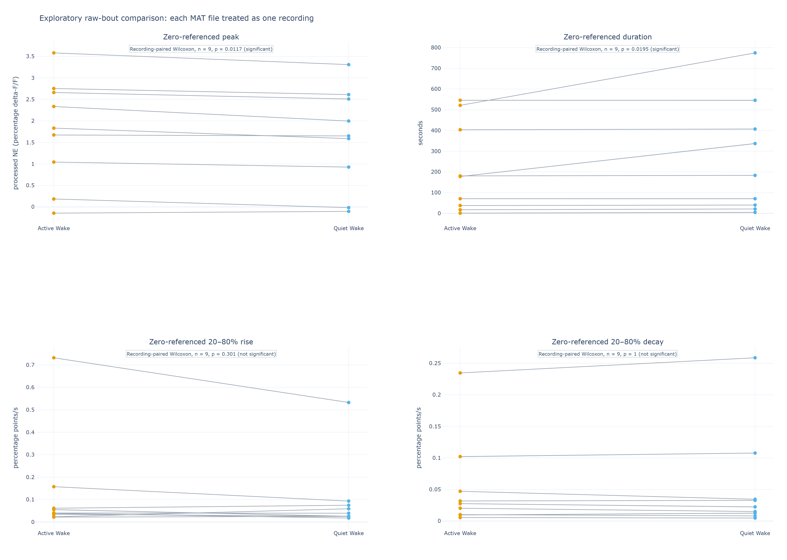

# Preliminary raw-bout recording comparison: NE during Active and Quiet Wake

**Status:** deliberately exploratory sensitivity analysis, 2026-09-16. This report
uses the literal values of the already processed NE percentage delta-F/F trace within
each Wake bout, without subtracting a new rolling local baseline. It is a complement
to—not a replacement for—the [local-baseline cohort report](preliminary_report.md).

This version asks the obvious, simpler question: in each labelled Active- or
Quiet-Wake bout, how high does the stored processed NE trace get? It deliberately
treats every MAT file as a separate recording for this preliminary screen, including
multiple files that may come from the same mouse. That shortcut increases the number
of recording pairs but is not a valid mouse-level biological inference.

## Executive summary

- All nine available MAT files contribute as separate recordings. The file with a
  longer NE trace is retained: analysis uses the common interval from the shared
  start through the shorter sleep-label duration, leaving its final 6.25 seconds of
  unlabelled NE outside the state comparison. No input file is altered.
- The **zero-referenced peak** is significantly higher in Active Wake than Quiet Wake
  in the nine recording pairs (two-sided paired Wilcoxon p = 0.0117). This is an
  exploratory recording-level signal, not a mouse-level result.
- Once a bout peak is assigned to its state, its 20%/80% crossings may occur outside
  that bout, as in the primary peak-state analysis. All nine recordings therefore
  provide timing pairs. Zero-referenced duration differs nominally (p = 0.0195),
  while rise and decay slopes do not.
- Unlike the local-baseline report, this analysis retains all labelled common-start
  bouts, including the previously documented recording-start excursions. That makes
  the sensitivity transparent, but it also leaves those artifacts able to influence
  the result.

## Summary of results

Each MAT file first contributes a median and IQR across its own eligible Wake bouts.
The table then summarizes those per-recording medians across the recording pairs.
Orange denotes Active Wake and light blue Quiet Wake. The p-values are paired by
recording, but the rows are provisionally treated as independent even though some
recordings may share a mouse; see [Appendix B](#appendix-b-recording-level-statistics-and-limitation).

| Zero-referenced measure | Active Wake | Quiet Wake | Recording pairs | p-value / interpretation |
|---|---:|---:|---:|---|
| Peak processed NE (percentage delta-F/F) | 1.833 (1.044–2.661) | 1.651 (0.927–2.510) | n = 9 | 0.0117; significant exploratory recording-level signal |
| Duration (s) | 177.92 (37.94–403.57) | 183.52 (40.23–406.87) | n = 9 | 0.0195; significant exploratory recording-level difference |
| 20–80% rise slope (percentage points/s) | 0.040 (0.035–0.062) | 0.039 (0.026–0.075) | n = 9 | 0.301; not significant |
| 20–80% decay slope (percentage points/s) | 0.028 (0.010–0.047) | 0.022 (0.013–0.035) | n = 9 | 1.000; not significant |

The significant peak and duration results are compatible with an Active/Quiet
difference in this file-level screen. They do **not** establish a state effect across
independent mice, and they do not adjudicate between the zero-referenced and
local-baseline definitions.

## Methodology

### Labels, recording interval, and unit of analysis

The analysis reads the final one-second Active-Wake (4) and Quiet-Wake (5) labels
without changing them. Each MAT file is intentionally assigned one unique recording
identity based on its filename. Both state summaries from the same file remain paired,
but files are provisionally treated as independent records. This is a pragmatic
exploratory assumption, not a claim that repeated recordings from one mouse are
biologically independent.

For every file, the comparison uses the interval beginning at the shared saved start
and ending when either the NE signal or label vector ends. This declared common-start,
minimum-duration rule retains `mouse5_day1.mat`: its state-labelled interval is used,
while its extra 6.25 seconds of NE cannot be assigned to a state and therefore is not
analyzed. No NE samples or sleep labels are rewritten, shifted, or silently trimmed.

### Literal zero-referenced NE peak within each Wake bout

A Wake bout is a continuous finite segment labelled entirely Active Wake or entirely
Quiet Wake. Within every such bout, the analysis takes the maximum of the stored,
processed NE percentage delta-F/F trace. That value is the **zero-referenced peak**:
it is relative to the trace's existing zero, not relative to a newly estimated local
baseline. Each recording/state is summarized by the median and IQR of its bout peaks.

This is not unprocessed fluorescence. The stored trace has already gone through the
upstream control fitting, delta-F/F conversion, smoothing, and downsampling. The
reason to include this sensitivity is that those upstream operations may make values
from different times reasonably comparable; that premise remains to be evaluated,
not assumed proven.

### Literal duration and 20–80% slopes

For a bout whose literal peak is positive, the detector searches backward and forward
from that peak across the entire continuous finite NE trace for the nearest 20% and
80% crossings of the zero-referenced peak value. The peak's bout supplies the state
assignment, but the crossings may occur outside that bout and across sleep-state
boundaries. It then calculates duration from the rising 20% to the falling 20%
crossing and rise/decay slopes through the middle 20–80% range.

If a bout's peak is non-positive or the surrounding finite trace lacks a required
crossing, its duration and slopes are missing for that metric. Its peak is still
retained. The NE trace is never bridged across an invalid sample, but the crossing
support is intentionally allowed across sleep-state boundaries. Exact formulas are in
[Appendix A](#appendix-a-zero-referenced-bout-metrics).

### How this differs from the local-baseline report

The primary [local-baseline report](preliminary_report.md) first estimates a rolling
20th-percentile baseline across continuous NE, detects baseline-subtracted elevations,
and assigns each event to the state at its peak. This sensitivity instead begins with
the state bouts and uses their literal stored NE maxima, but follows the same
peak-state attribution principle: crossing support can extend across state boundaries.
The two approaches answer related but different questions and should not be pooled or
presented as interchangeable estimates.

## Results

### Recording-paired raw-bout summaries

The zero-referenced peak and duration differ nominally in the nine-file screen. The
plot shows every file-level median; each line joins Active and Quiet summaries from
the same MAT file. The apparent p-values are conditional on treating those nine files
as independent recordings, which is the explicitly temporary simplification here.



**Figure 1.** Each point is a file-level median across bouts. Orange is Active Wake;
light blue is Quiet Wake. All panels include nine recording pairs. The duration and
slope support is attributed by the bout containing the peak, but is not constrained to
remain in that state.

### Interpretation for the proposal

This analysis provides a useful positive exploratory signal: literal stored NE peak
levels are higher during Active Wake in the available recording pairs. It is most
useful as an initial proposal figure because it is simple and transparent. It is not
a substitute for the local-baseline analysis, nor sufficient for a mouse-level claim,
because repeated file rows may share an animal and the zero reference may still drift
over a long recording.

The two reports together are informative rather than contradictory: they contrast a
local, drift-resistant elevation question with a literal processed-NE level question.
The next dataset should preserve recording-to-mouse identity and permit a predeclared
mouse-level analysis of both definitions.

## Appendix A: Zero-referenced bout metrics

Let `x(t)` be the stored processed percentage delta-F/F trace and let `P` be the
literal maximum within one finite, single-state Wake bout. There is no new baseline
subtraction. When `P > 0`, locate the nearest rise and fall crossings in the
continuous finite trace at `0.2P` and `0.8P`, named `t_r20`, `t_r80`, `t_d80`, and
`t_d20`. The bout containing `P` supplies the Active/Quiet assignment; crossing
support is allowed to cross state boundaries.

```text
zero-referenced peak = P
duration             = t_d20 - t_r20
rise slope           = 0.60 × P / (t_r80 - t_r20)
decay slope          = 0.60 × P / (t_d20 - t_d80)
```

The formula is deliberately literal: it measures thresholds relative to zero on the
processed trace. It is not equivalent to a conventional peak-above-baseline event
amplitude. The crossing-based metrics are set to missing, rather than fabricated, when
the required shape does not exist before the finite trace ends. In this run, 1,624 of
1,766 complete Active-Wake supports and 1,696 of 1,759 Quiet-Wake supports cross at
least one state boundary, so these timing metrics are contextual peak-state measures,
not pure within-state kinetics.

## Appendix B: Recording-level statistics and limitation

The comparison uses one Active and one Quiet median per MAT file, then applies a
two-sided paired Wilcoxon signed-rank test across files. Pairing is retained because
both state summaries come from the same recording. The test is nonparametric and
appropriate for a small set of paired numeric values, but its usual interpretation
assumes those pairs are independent.

That assumption is knowingly provisional here: some files are repeated recordings
from the same mouse. Therefore p-values in this report are screening statistics, not
confirmatory biological evidence. They should not be combined with the independent-
mouse local-baseline p-values or used to claim a final state effect.

## Reproducibility

The raw-bout tables and figure were generated with:

```powershell
python scripts/analyze_raw_bouts.py `
  --input-dir data `
  --output outputs/raw_bout_recording_comparison_20260916

python scripts/render_raw_bout_report_figures.py `
  --analysis outputs/raw_bout_recording_comparison_20260916 `
  --output docs/assets/raw_bout_recording_comparison
```

Both output directories must be new or empty, preventing accidental mixing of results
from different input sets.
