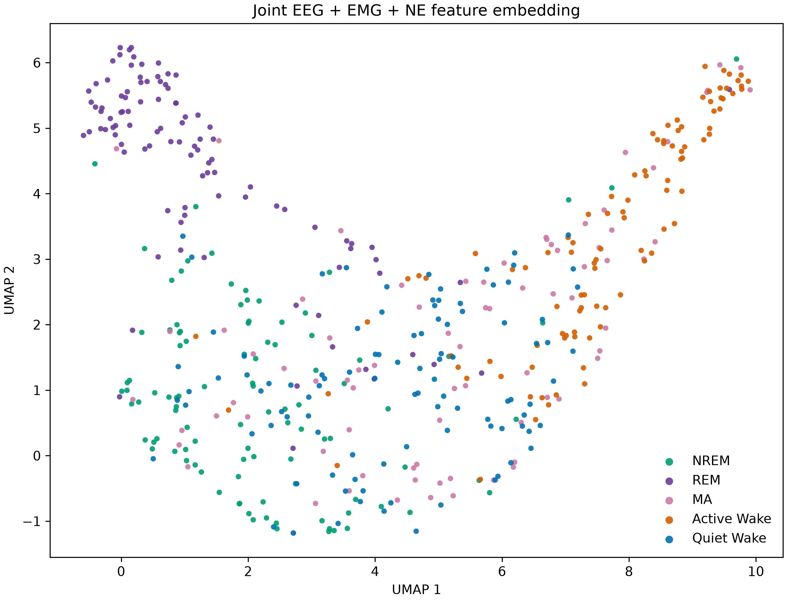

# Exploratory joint EEG + EMG + NE UMAP

**Status:** first-pass UMAP completed for the current ten MAT recordings on
2026-09-17. This remains a compact feature map rather than a new sleep scorer or a
test of independent biological replication.

## Question and interpretation boundary

Each point is one final labelled second. UMAP is fitted without sleep labels, which
are used only to colour the completed plot. The question is whether the joint
four-feature physiological observations occupy recognizable regions for Active Wake,
Quiet Wake, MA, NREM, and REM.

The full map intentionally includes EMG RMS even though the current automatic
Active/Quiet subdivision ranks Wake seconds by a closely related EMG-RMS measure.
Therefore, apparent separation of Active from Quiet in this panel is expected in
part and is **not** independent validation of that split. Its purpose is to locate
the EMG-defined states in the whole EEG/EMG/NE landscape and to show their relation
to the ordinary sleep stages. An EEG+NE-only embedding and held-out-recording
prediction are separate future tests of physiological distinctiveness beyond EMG.

## Predeclared four-feature panel

| Modality | Feature for each labelled second | Reason for inclusion |
|---|---|---|
| EEG | log10 delta-band power, nominal 0.5--4 Hz | Canonical NREM slow-wave feature. |
| EEG | log10 theta-band power, nominal 6--9 Hz | Canonical REM/wake rhythmic feature. |
| EMG | Root-mean-square of the native EMG samples after subtracting that second's mean | Compact broadband muscle-activity feature; deliberately related to the Active/Quiet rule. |
| NE | Arithmetic mean of saved processed percentage delta-F/F samples within the score second | Simple first-pass NE level; no extra smoothing, baseline subtraction, or event detection. |

These are the high-yield EEG/EMG quantities routinely used for mouse sleep staging:
NREM has notable delta power, REM has theta activity with low muscle tone, and wake
has greater EMG activity. The chosen source bands follow the mouse EEG/EMG staging
descriptions in [Li et al. (2022)](https://pmc.ncbi.nlm.nih.gov/articles/PMC9440422/)
and [Yamamoto et al. (2016)](https://pmc.ncbi.nlm.nih.gov/articles/PMC4781694/).

One-second spectral summaries necessarily have a coarse approximately 1-Hz Fourier
grid. This deliberately avoids borrowing EEG from adjacent labels, but it means the
0.5-Hz lower delta edge is not individually resolved; no zero padding or temporal
smoothing is used to imply otherwise. The NE feature is a slow contextual level,
not a phasic measurement: the saved NE trace has already been strongly smoothed
upstream.

## Reproducible construction

- The analysis reads only the raw `eeg`, `emg`, saved `ne`, their saved sampling
  rates, and final `sleep_scores`; it does not relabel or rewrite any MAT file.
- A score second is kept only if a complete corresponding interval exists in all
  three streams and all four features are finite. Coarse Wake/unscored seconds are
  excluded from the displayed five-state panel.
- Each feature is centred by its recording median and divided by its recording IQR.
  Thus recording-specific acquisition scale or NE baseline does not define distance.
- At most 10 seconds from each available state in each recording are selected with
  seed `20260917`; this prevents long Active-Wake runs from dominating the displayed
  density and holds the first pass below UMAP's exact-neighbor threshold. It does not
  create independent observations.
- UMAP uses Euclidean distance, `n_neighbors=30`, `min_dist=0.2`, `n_epochs=50`,
  and the same seed. Labels are not supplied to `fit_transform`. `n_neighbors`
  defines the 30-point neighborhood scale UMAP emphasizes; `min_dist` sets moderate
  compactness of nearby points in the display; and `n_epochs` is the 2-D layout
  optimization count. These are visualization choices, not statistical tests.

`UMAP 1` and `UMAP 2` are unitless learned coordinates. Their direction, origin, and
rotation have no physiological meaning: only local proximity in the embedding is
interpretable.

The implementation is [`wake_ne_analysis/umap.py`](../wake_ne_analysis/umap.py) and
the executable entry point is [`scripts/analyze_umap.py`](../scripts/analyze_umap.py).
Run tables belong in ignored `results/umap/<run>/`; presentation PNGs belong in
`docs/assets/umap/<run>/` via `--results-dir` and `--figure`, respectively.

## Verified feature-extraction result

The extraction completed for all ten MAT files. Of 106,452 complete multimodal score
seconds, 106,434 had finite values for every predeclared feature and were retained.
The remaining 18 seconds had invalid NE values and were excluded; they were neither
imputed nor bridged. The retained state counts were 60,657 NREM, 30,477 Active Wake,
7,620 Quiet Wake, 4,939 REM, and 2,741 MA seconds.

## First-pass UMAP

The fixed-seed balanced display has 480 points: 100 each for NREM, REM, Active Wake,
and Quiet Wake (10 per state in each of ten recordings), plus 80 MA points because
MA occurred in only eight recordings. Audit tables and the sampled coordinates are
stored locally in ignored `results/umap/initial_500_points/`; the figure above is the
presentation artifact.

Active Wake forms the clearest right-side region, whereas Quiet Wake is more diffuse
and overlaps NREM and MA. REM has a prominent upper-left neighborhood; MA is mixed
with nearby states. This is descriptive structure in this jointly embedded feature
space, not independent evidence for Active versus Quiet Wake: EMG activity is part
of the feature panel and is related to how those labels were assigned. No per-second
cluster-separation p-value is reported because seconds within a recording are
correlated.
