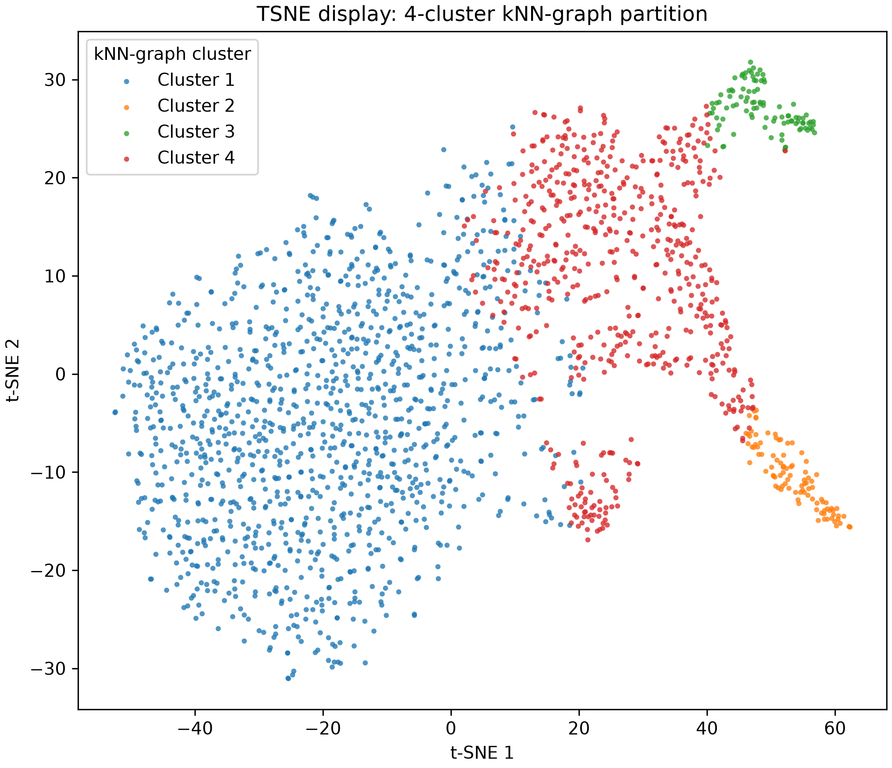
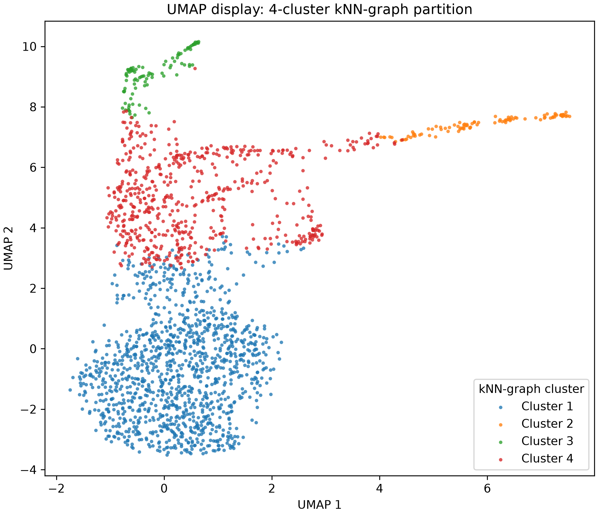
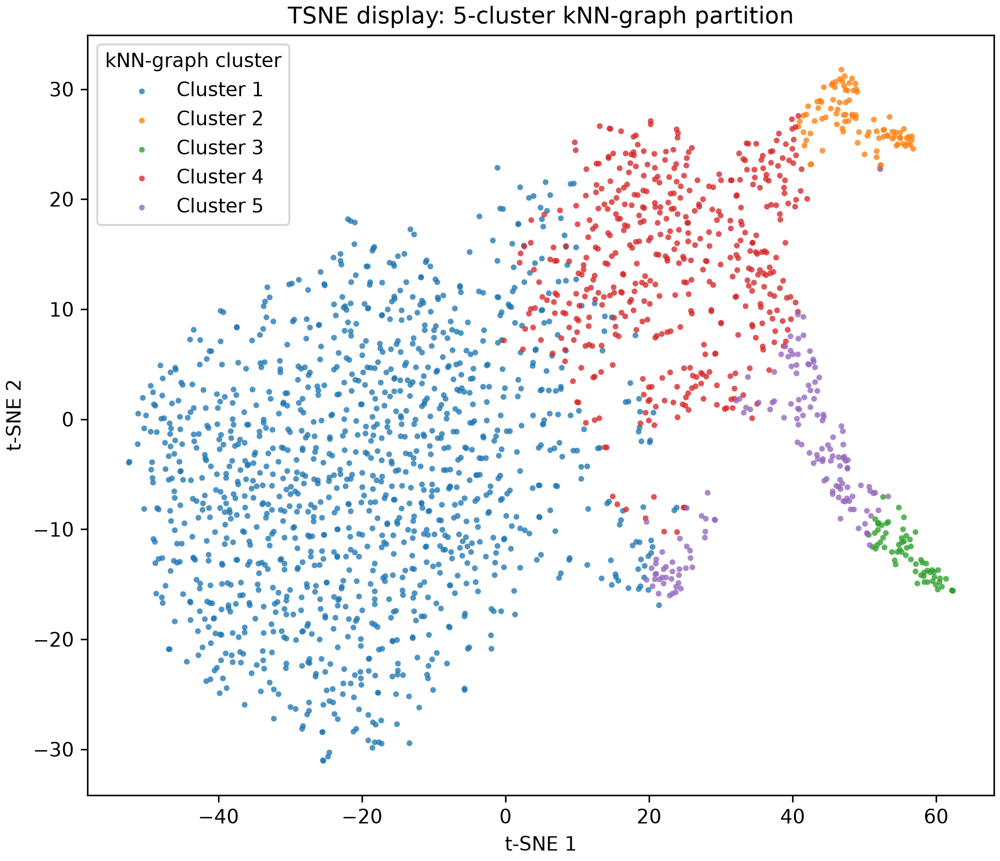
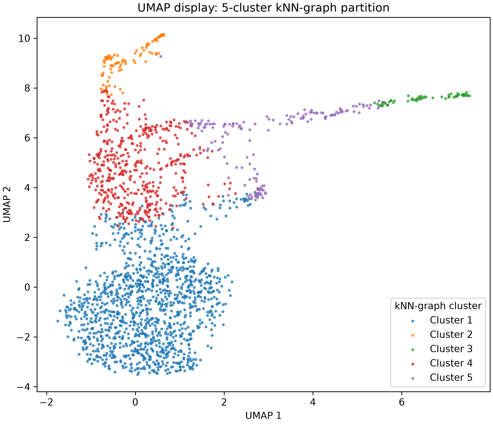

# Wake-only cluster visualization follow-up

**Status:** completed on 2026-09-18. This is a focused follow-up to
[`cluster_visualization_report.md`](cluster_visualization_report.md), prompted by
the request to recluster only Active and Quiet Wake with the complete EEG+EMG+NE
feature set. It does not replace the original all-stage and combined-Wake
descriptive maps.

## Question

Do the full 29-feature vectors of seconds already labelled Active or Quiet Wake
form recurring groups when those labels are excluded from the clustering step? To
make this concrete without choosing a single resolution in advance, the same
full-space k-nearest-neighbour (kNN) graph is partitioned into 3, 4, and 5 groups.

This is a descriptive, label-audited clustering exercise. It asks whether the
full feature space has Wake organization beyond one compact cloud; it is **not** a
test of an independently derived Active/Quiet distinction or a claim that each
partition identifies biological Wake subtypes.

## Features

This follow-up uses all 29 saved features: the 22 EEG band-power summaries, five
EMG summaries, and two NE summaries. It reads the same already
within-recording-robust-scaled feature archives as the parent report and neither
reopens raw MAT files nor re-extracts, relabels, or rescales a second. The exact
feature definitions, including the one-second EEG epoch convention and EMG burst
definition, are in the parent report's [Features](cluster_visualization_report.md#features),
[EEG appendix](cluster_visualization_report.md#appendix-eeg-band-power-features),
and [EMG appendix](cluster_visualization_report.md#appendix-emg-burst-features).

EMG is intentionally retained here. The parent report showed that the conspicuous
Wake geometry was not retained in the EEG+NE-only representation; the present
question is therefore explicitly about organization in the joint EEG+EMG+NE
feature space.

## Sampling

Only final-labelled Active Wake and Quiet Wake seconds were eligible. With seed
`20260918`, the analysis sampled up to 100 seconds **per source label per
recording** from each of ten feature archives, yielding 2,000 points: 1,000
source Active Wake and 1,000 source Quiet Wake, each represented in all ten
recordings. This balances source-label representation for the audit and figure;
the resulting cluster sizes are therefore not estimates of natural state
prevalence.

The upstream source label selected and balanced the sample, but it did **not**
enter the kNN graph or the clustering. It is shown afterward only to assess how
the unsupervised groups relate to the existing labels.

## kNN-graph clustering and display settings

For the 2,000 sampled 29-dimensional vectors, the analysis constructed an
unweighted, symmetric 30-nearest-neighbour graph using Euclidean distance in the
saved robust-scaled feature space. That graph had 45,893 undirected edges and one
connected component. Spectral clustering of this graph produced the requested
3-, 4-, and 5-group partitions. Thus, “kNN clustering” here means graph-based
spectral partitioning—not a supervised kNN classifier and not clustering of a
t-SNE or UMAP image.

t-SNE and UMAP are display-only views of the same sampled feature vectors. They
use the parent report's settings except for seed `20260918`: t-SNE has perplexity
30 and 1,000 iterations; UMAP has 30 neighbours, `min_dist=0.2`, and 200 epochs.
Their axes are unitless layout coordinates, not physiological variables. See the
parent report's [dimension-reduction settings](cluster_visualization_report.md#dimension-reduction-settings)
for the broader presentation context.

## Results

### Existing Active/Quiet labels on the display maps

The source labels, not used for graph construction or partitioning, occupy a
similar broad ordering in both displays: most Quiet Wake seconds lie in the
large lower/left region, whereas Active Wake supplies the rightward and upper
branches as well as some of the shared central region. The overlap matters: the
labels do not map onto two perfectly separated islands.


### Three groups

| kNN-graph cluster | Seconds | Recordings | Source Active | Source Quiet | Reading |
|---|---:|---:|---:|---:|---|
| 1 | 1,763 | 10 | 763 | 1,000 | Broad mixed group containing every sampled Quiet second and 76.3% of sampled Active seconds. |
| 2 | 111 | 8 | 111 | 0 | Small Active-only extreme. |
| 3 | 126 | 4 | 126 | 0 | Small Active-only extreme with limited recording recurrence. |

At this coarse resolution, the graph separates two compact Active-only ends from
a broad central population rather than separating all Active and Quiet seconds.
The broad group includes all Quiet seconds and many Active seconds, so the
three-group result is not a simple recovery of the two source labels.


### Four groups

| kNN-graph cluster | Seconds | Recordings | Source Active | Source Quiet | Reading |
|---|---:|---:|---:|---:|---|
| 1 | 1,227 | 10 | 280 | 947 | Quiet-associated broad group. |
| 2 | 97 | 7 | 97 | 0 | Small Active-only extreme. |
| 3 | 96 | 3 | 96 | 0 | Small Active-only extreme with limited recording recurrence. |
| 4 | 580 | 10 | 527 | 53 | Active-associated broad group. |

The four-group partition is the clearest descriptive resolution. It divides the
former broad group into a Quiet-associated population (77.2% source Quiet) and
an Active-associated population (90.9% source Active), and both occur in every
recording. The two smaller Active-only groups remain; one occurs in only three
recordings. This supports recurring joint-feature organization associated with
the existing labels, while also showing that the graph has finer local structure
within the Active-associated region.





### Five groups

| kNN-graph cluster | Seconds | Recordings | Source Active | Source Quiet | Reading |
|---|---:|---:|---:|---:|---|
| 1 | 1,227 | 10 | 274 | 953 | Quiet-associated broad group. |
| 2 | 93 | 3 | 93 | 0 | Rare Active-only extreme. |
| 3 | 64 | 3 | 64 | 0 | Rare Active-only extreme. |
| 4 | 464 | 10 | 421 | 43 | Active-associated broad group. |
| 5 | 152 | 9 | 148 | 4 | Additional Active-associated branch. |

At five groups, the Quiet-associated and main Active-associated populations
remain across all ten recordings. A further Active-associated branch appears in
nine recordings, but two other Active-only groups now occur in only three
recordings each. Five groups therefore add descriptive granularity, not a
predeclared or validated number of Wake states. Cluster numbers are arbitrary
within each partition and must not be treated as matched identities across the
three resolutions.





## Interpretation caveat

The strongest result is modest: in this balanced sample, the joint feature space
contains a recurring Quiet-associated population and a recurring
Active-associated population, each represented in all ten recordings at the
four- and five-group resolutions. The smaller Active-only groups are visually
compact but have incomplete recording recurrence, so they are not yet defensible
as general Wake subtypes.

This association is not independent validation of the source labels. Those
labels were produced upstream from within-recording EMG activity, and this
analysis deliberately includes five EMG features. It is therefore unsurprising
that the partitions organize with the labels; the finding should be described as
an **EMG-associated organization of the joint feature space**, not as proof of
distinct Wake biology. The parent report's EMG-free comparison remains the
critical guardrail: it did not show similarly conspicuous Wake structure.

Nor do the figures establish a statistically optimal cluster count. Consecutive
seconds are correlated, recordings may not be independent mice, and graph
parameters, seed stability, and recording-held-out assignment have not been
tested. t-SNE/UMAP separations, point density, and apparent branch boundaries are
not cluster statistics.

## Fairer follow-up

Before naming a Wake subtype, predeclare a cluster selection and stability rule;
repeat the graph construction across sensible neighbour counts and seeds; and
evaluate whether a cluster assignment or classifier trained on one set of
recordings generalizes to held-out recordings. Representative raw EMG and RMS
envelope traces should be inspected for the small Active-only groups, along with
the existing EMG burst-threshold sensitivity work. A non-EMG feature-set check
should remain part of any claim about Wake physiology rather than movement-linked
organization.

## Reproducibility and retained audits

The analysis was generated with:

```powershell
& "C:\Users\yzhao\miniconda3\condabin\conda.bat" run --no-capture-output -n ne_umap python scripts/plot_wake_knn_clusters.py `
  --feature-dir data/derived_features/features_29 `
  --results-dir results/wake_knn_clusters_20260918 `
  --figures-dir writeups/assets/wake_knn_clusters_20260918 `
  --n-clusters 3 4 5
```

The ignored `results/wake_knn_clusters_20260918/` directory retains the exact
configuration, sampled point identities, graph audit, per-cluster source-label
and recording composition, and within-recording robust-scaled feature medians.
Those medians are an audit for inspecting candidate groups, not 29 separate
statistical tests.
