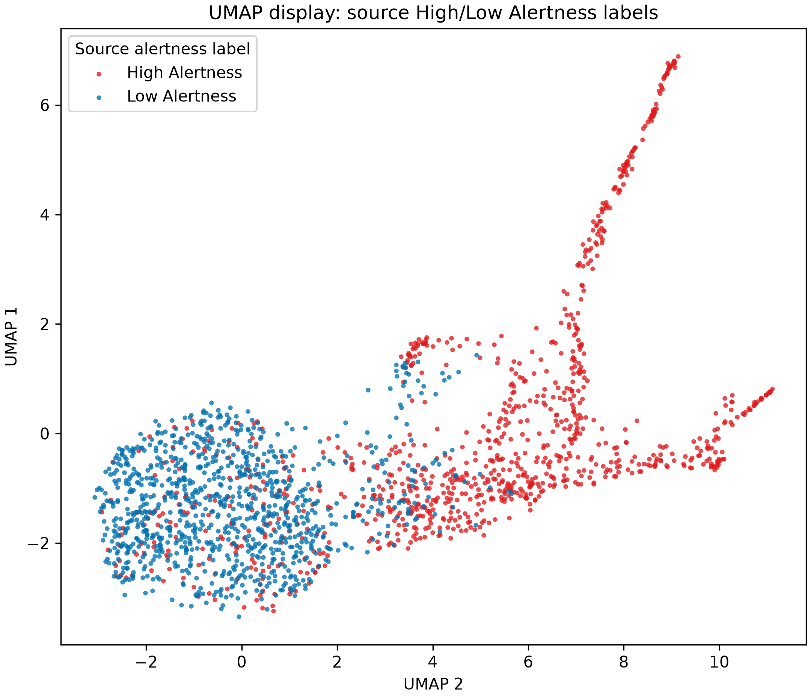
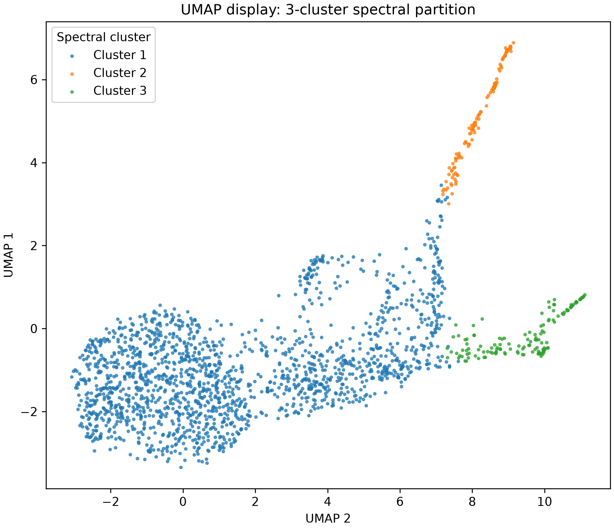
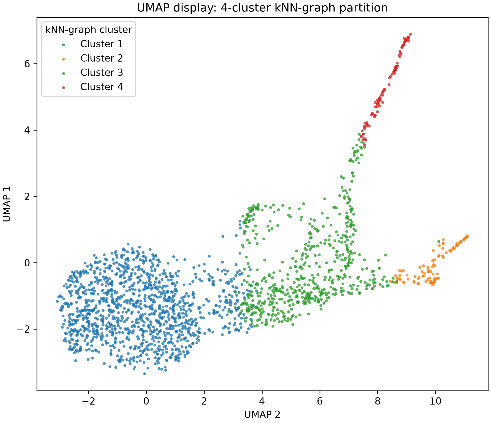
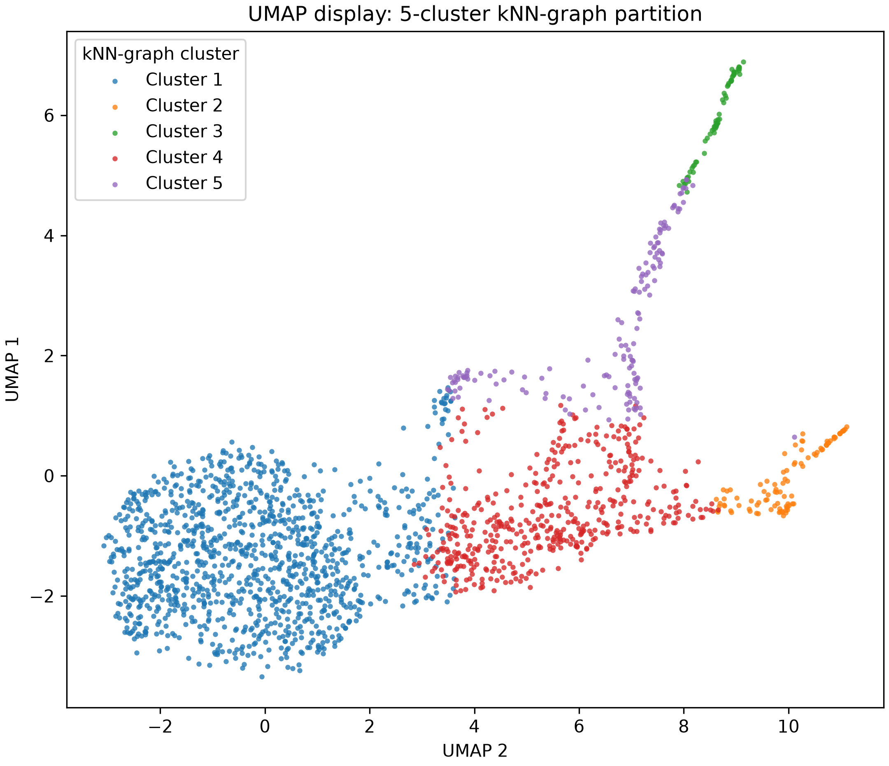

# Wake-only cluster visualization: NE-excluded follow-up

**Status:** completed on 2026-09-21. This is the matched NE-feature sensitivity
to [`cluster_visualization_wake_only_report.md`](cluster_visualization_wake_only_report.md).
It follows the same Wake-only sampling, graph construction, requested 3/4/5
partitions, alertness terminology, palette, and UMAP axis order. It differs
only by omitting both NE summaries before UMAP fitting and graph clustering.

## Question

Does removing the two saved NE summaries materially change the descriptive
High/Low Alertness organization or the graph partitions of the same Wake
seconds? This is a feature-panel sensitivity check, not a test of whether NE has
no biological relation to alertness.

High Alertness and Low Alertness are the unchanged upstream source labels: score 4
and score 5, respectively. The labels select and
balance the display sample but never enter the graph or clustering.

## Features

The parent Wake-only report uses 29 saved features: 22 EEG summaries, five EMG
summaries, and `ne_mean` plus `ne_slope_ols_per_second`. This matched run uses the
remaining **27 EEG+EMG features** and excludes exactly those two NE columns. It
uses their existing within-recording robust-scaled values; no MAT file was
reopened, no feature was re-extracted, and no remaining value was rescaled.

See the parent report's [Features](cluster_visualization_wake_only_report.md#features)
and the original cluster report's [EEG](cluster_visualization_report.md#appendix-eeg-band-power-features)
and [EMG](cluster_visualization_report.md#appendix-emg-burst-features) appendices
for the feature definitions. The absence of NE here is the only feature-panel
change.

## Sampling

The same seed (`20260918`) sampled up to 100 High Alertness and 100 Low Alertness
seconds per recording from the same ten feature archives: 1,000 seconds of each
source label and 2,000 seconds total. Both labels occur in all ten recordings.
This is a label-balanced display sample, so partition sizes are not natural
prevalence estimates. See the parent Wake-only report's
[Sampling](cluster_visualization_wake_only_report.md#sampling) section for the
selection rationale.

## Spectral clustering of a k-nearest-neighbor graph and UMAP display settings

The 27-dimensional vectors form an unweighted, symmetric 30-nearest-neighbor
graph under Euclidean distance. It has 45,534 undirected edges, one connected
component, minimum symmetric degree 30, and maximum symmetric degree 233.
Spectral clustering creates the requested 3-, 4-, and 5-group partitions. It is
not a supervised kNN classifier and does not cluster UMAP coordinates.

This sensitivity run intentionally generated **UMAP only**, rather than a new
t-SNE fit. UMAP uses the matched settings:
30 neighbors, `min_dist=0.2`, 200 epochs, and seed `20260918`. UMAP 2 is the
horizontal axis and UMAP 1 is vertical, so the high-alertness direction is shown
left to right. The shared source-label palette is High Alertness red
`#E31A1C` / RGB `(227, 26, 28)` and Low Alertness blue `#0072B2` / RGB
`(0, 114, 178)`. UMAP axes remain unitless layout coordinates.

## Results

### Existing High/Low Alertness labels

Without either NE feature, the source-label UMAP retains a compact
Low-Alertness-dominated region on the left and High Alertness-dominated branches
to the right. There is still a shared intermediate region, so the two labels do
not form perfectly isolated UMAP islands. Coordinate positions cannot be compared
numerically with the separate full-feature UMAP fit; the label composition and
matched graph assignments below provide the more useful comparison.



### Three groups

| Spectral cluster | Seconds | Recordings | Source High | Source Low | Reading |
|---|---:|---:|---:|---:|---|
| 1 | 1,755 | 10 | 755 | 1,000 | Broad mixed group containing every sampled Low Alertness second and 75.5% of sampled High Alertness seconds. |
| 2 | 112 | 8 | 112 | 0 | Small High-Alertness-only extreme. |
| 3 | 133 | 5 | 133 | 0 | Small High-Alertness-only extreme with limited recording recurrence. |



#### Withheld NE-feature check

The two NE features were withheld from graph construction and clustering, then
compared afterward.  Each sampled second contributes its saved
**within-recording robust-scaled** value; the table summarizes those seconds as
median (IQR).  Thus these are relative-to-recording NE positions, rather than
pooled raw fluorescence values.

| Spectral cluster | Seconds | Recordings | `ne_mean` | `ne_slope_ols_per_second` |
|---|---:|---:|---:|---:|
| 1 | 1,755 | 10 | 0.448 (−0.004–0.809) | 0.064 (−0.442–0.522) |
| 2 | 112 | 8 | 0.981 (0.770–1.254) | 0.072 (−0.465–0.577) |
| 3 | 133 | 5 | −0.011 (−0.318–0.509) | 0.093 (−0.262–0.467) |

Two-sided Mann–Whitney tests use every sampled second in each cluster, with
[Holm correction](#appendix-why-use-holm-correction) across the two NE features
and three cluster pairs (six tests) in this partition.  `ne_mean` differs after
correction in every pair: 1 versus 2, p = 5.52 × 10⁻¹⁹; 1 versus 3,
p = 2.65 × 10⁻⁷; and 2 versus 3, p = 2.96 × 10⁻¹⁸.  No slope comparison differs
(all adjusted p = 1.000).

### Four groups

| Spectral cluster | Seconds | Recordings | Source High | Source Low | Reading |
|---|---:|---:|---:|---:|---|
| 1 | 1,214 | 10 | 272 | 942 | Low-Alertness-associated broad group. |
| 2 | 97 | 3 | 97 | 0 | Small High-Alertness-only extreme. |
| 3 | 592 | 10 | 534 | 58 | High-Alertness-associated broad group. |
| 4 | 97 | 7 | 97 | 0 | Small High-Alertness-only extreme. |

As in the full-feature analysis, the four-group partition has a broad
Low-Alertness-associated population (77.6% source Low) and a broad
High-Alertness-associated population (90.2% source High), both represented in
all ten recordings. The numbering of the two small high-alertness extremes differs
from the full-feature run; cluster numbers are arbitrary and cannot be compared
by their integer label.



#### Withheld NE-feature check

These summaries use the same pooled-seconds robust-scaled procedure as the
three-group check.

| Spectral cluster | Seconds | Recordings | `ne_mean` | `ne_slope_ols_per_second` |
|---|---:|---:|---:|---:|
| 1 | 1,214 | 10 | 0.463 (0.024–0.807) | 0.069 (−0.436–0.542) |
| 2 | 97 | 3 | −0.053 (−0.331–0.462) | 0.087 (−0.361–0.424) |
| 3 | 592 | 10 | 0.407 (−0.033–0.812) | 0.047 (−0.465–0.486) |
| 4 | 97 | 7 | 0.990 (0.776–1.264) | 0.116 (−0.369–0.614) |

Two-sided Mann–Whitney tests use every sampled second, with Holm correction
across 12 tests (two features × six cluster pairs).  `ne_mean` differs after
correction for 1 versus 2 (p = 5.38 × 10⁻⁷), 1 versus 4 (2.90 × 10⁻¹⁸), 2 versus
3 (5.14 × 10⁻⁶), 2 versus 4 (2.02 × 10⁻¹⁵), and 3 versus 4 (3.62 × 10⁻¹³), but
not for the two broad groups 1 versus 3 (p = 1.000).  No slope comparison
differs (all adjusted p = 1.000).

### Five groups

| Spectral cluster | Seconds | Recordings | Source High | Source Low | Reading |
|---|---:|---:|---:|---:|---|
| 1 | 1,218 | 10 | 271 | 947 | Low-Alertness-associated broad group. |
| 2 | 95 | 3 | 95 | 0 | Rare High-Alertness-only extreme. |
| 3 | 63 | 3 | 63 | 0 | Rare High-Alertness-only extreme. |
| 4 | 473 | 10 | 422 | 51 | High-Alertness-associated broad group. |
| 5 | 151 | 9 | 149 | 2 | Additional High-Alertness-associated branch. |

The five-group result likewise retains broad Low- and High-Alertness-associated
populations across all ten recordings, an additional High-Alertness-associated
branch across nine recordings, and two rare high-alertness extremes with only
three-recording recurrence.



#### Withheld NE-feature check

These summaries again use every sampled second in each cluster.

| Spectral cluster | Seconds | Recordings | `ne_mean` | `ne_slope_ols_per_second` |
|---|---:|---:|---:|---:|
| 1 | 1,218 | 10 | 0.480 (0.026–0.803) | 0.065 (−0.442–0.542) |
| 2 | 95 | 3 | −0.048 (−0.335–0.480) | 0.087 (−0.382–0.427) |
| 3 | 63 | 3 | 1.024 (0.851–1.257) | 0.129 (−0.325–0.487) |
| 4 | 473 | 10 | 0.299 (−0.067–0.779) | 0.049 (−0.402–0.503) |
| 5 | 151 | 9 | 0.764 (0.401–1.171) | 0.080 (−0.478–0.508) |

Two-sided Mann–Whitney tests use every sampled second, with Holm correction
across 20 tests (two features × ten cluster pairs).  `ne_mean` differs after
correction in nine of ten pairs (adjusted p = 1.95 × 10⁻¹⁰ to 0.0142); the
exception is 1 versus 4 (p = 0.190).  No slope comparison differs (all adjusted
p = 1.000).

## Comparison with the full EEG+EMG+NE panel

For the identical 2,000 sampled point identities, the NE-excluded and
full-feature graph partitions have high label-invariant adjusted Rand agreement:
0.978 for three groups, 0.964 for four groups, and 0.959 for five groups.
Together with the closely matching source-label compositions above, this means
that removing these two per-second NE summaries does **not materially change this
particular 29-feature Wake clustering result**.

This does not show that NE is biologically irrelevant. It only says that, in this
within-recording robust-scaled, EMG-inclusive one-second representation, the two
available NE summaries are not necessary to reproduce the displayed partitions.
EMG remains in both panels and is entangled with the source alertness labels;
other NE timescales, transformations, features, or independent behavioral
measurements were not tested.

## Interpretation caveat

The NE-excluded sensitivity reinforces the parent report's central limitation:
the recurring High- and Low-Alertness-associated organization is an
EMG-associated pattern in the joint feature space, not independent proof of
distinct Wake biology. Small pure High-Alertness groups show purity for a subset;
they do not show complete High/Low separability without near-complete coverage and
absence of cross-label contamination. Consecutive seconds and recordings are not
independent observations, and neither UMAP appearance nor graph-cluster count is
a biological cluster statistic.

The withheld NE-feature comparisons intentionally use sampled **seconds** as
their units to screen for possible NE patterns across the pooled cluster
distributions. Their Mann–Whitney p-values are therefore pseudoreplicated:
adjacent seconds are correlated, clusters have unequal sizes, and repeated
recordings are not independent animals. They identify descriptive candidate
patterns, not independent-mouse biological evidence.

## Fairer follow-up

Retain this NE-excluded analysis as a feature-panel sensitivity result. Before
naming a Wake subtype or making an alertness-separability claim, predeclare graph
parameter/seed stability and a recording-held-out evaluation; inspect the small
High-Alertness-only groups against raw EMG/envelope traces; and use an independent
non-EMG behavioral or physiological measure where available.

## Reproducibility and retained audits

The user-generated NE-excluded run was:

```powershell
conda activate ne_umap

python scripts\plot_wake_knn_clusters.py `
  --feature-dir data\derived_features\features_29 `
  --results-dir results\wake_knn_clusters_ne_excluded_20260921 `
  --figures-dir writeups\assets\wake_knn_clusters_ne_excluded_20260921 `
  --n-clusters 3 4 5 `
  --exclude-ne-features `
  --umap-only
```

The ignored `results/wake_knn_clusters_ne_excluded_20260921/` directory retains
the configuration, sampled point identities, graph audit, per-cluster source-label
and recording composition, and 27-feature median audit. The adjusted Rand values
above compare the matched point identities in that directory with the existing
full-feature result; they are descriptive agreement measures, not a held-out
validation statistic. The withheld NE checks pool the saved robust-scaled
`ne_mean` and `ne_slope_ols_per_second` columns of each resolution's
`clustered_wake_points.csv`, summarize each cluster's seconds by median (IQR),
and use two-sided Mann–Whitney tests with the stated within-resolution Holm
family.

## Appendix: Why use Holm correction?

Each cluster resolution involves more than one statistical comparison: several
cluster pairs and two withheld NE features.  If every p-value were interpreted
at 0.05 on its own, the chance of at least one false-positive result rises as
the number of comparisons rises.  Holm correction controls that family-wide
false-positive risk while retaining more power than applying one identical,
fully conservative Bonferroni threshold to every test.

Holm's procedure orders the p-values from smallest to largest.  It first judges
the smallest against the strictest threshold, then progressively relaxes the
threshold for the remaining p-values only if the earlier comparisons pass.  The
reported Holm-adjusted p-value is therefore the p-value after accounting for the
other planned NE comparisons within that cluster resolution.  It does not make
clusters more balanced, create independent recordings, or prove that a
non-significant comparison represents biological equality; it only guards the
significance screen against finding a chance result among several tests.

### How does this differ from Bonferroni correction?

Bonferroni correction uses one fixed, stricter threshold for every comparison:
with *m* planned tests, each is judged against 0.05 / *m* (or, equivalently, each
p-value is multiplied by *m*).  It also controls the family-wide false-positive
risk, but can be unnecessarily strict when the smallest p-value has already
passed.  Holm starts with that same strict first threshold, then becomes less
strict for the remaining tests only after earlier comparisons pass.  It therefore
has the same error-control goal as Bonferroni while usually retaining more power.
