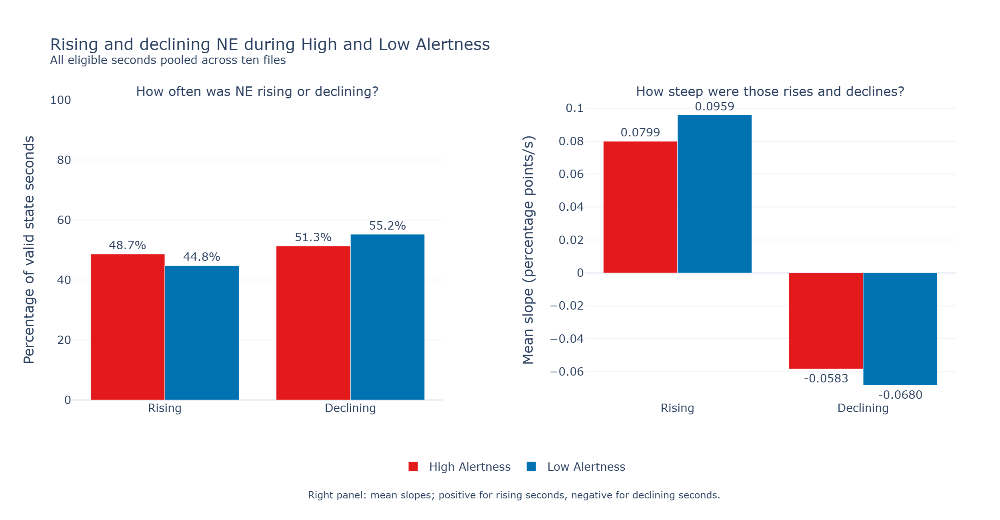
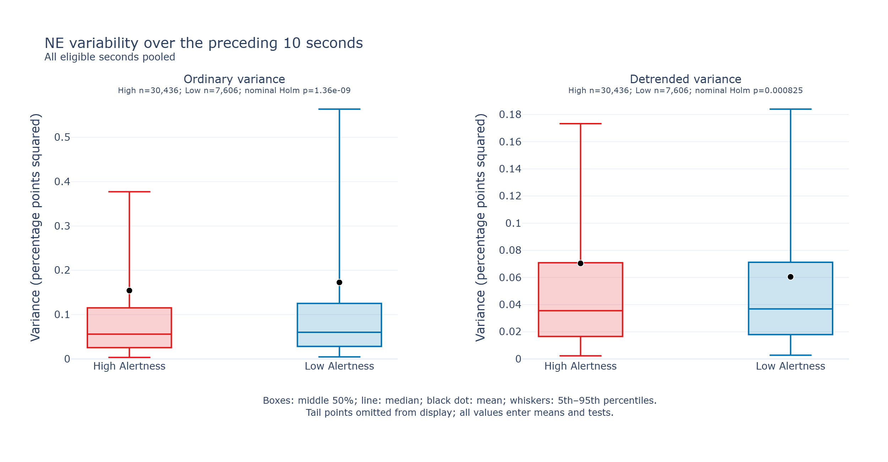

# Preliminary NE dynamics report: High and Low Alertness

**Status:** descriptive pooled-seconds analysis of ten files, September 23, 2026.

## Questions

1. Is NE more often rising or declining during High versus Low Alertness?
2. Do NE slopes differ between the two labels, overall and during rises and declines?
3. Does NE variance over the preceding 10 seconds differ between the two labels?

## Executive summary

- NE was declining during **55.2% of Low Alertness seconds versus 51.3% of High
  Alertness seconds**, a difference of 3.9 percentage points.
- Among declining seconds, mean slope was **−0.0680 in Low versus −0.0583
  in High Alertness**, indicating 16.7% steeper declines in Low.
- Among rising seconds, mean slope was **0.0959 in Low versus 0.0799 in High
  Alertness**, 19.9% greater in Low.
- Mean absolute slope was **0.0805 in Low versus 0.0688 in High Alertness**,
  17.0% greater in Low. Mean signed slope was positive in both labels.
- Mean variance over the preceding 10 seconds was **0.1727 in Low versus 0.1543
  in High Alertness**, 11.9% greater in Low.
- A secondary check removed a linear trend separately within each 10-second
  window. Mean remaining variance was **0.0605 in Low versus 0.0704 in High**,
  14.1% lower in Low. The higher ordinary variance therefore does not extend
  to variation remaining after local detrending.

## Summary of results

All eligible seconds were pooled across files, with equal weight per second.
Reported averages are arithmetic means. Slope units are percentage points/s.
Direction-specific means include only seconds with that direction.

| Reported measure | High Alertness | Low Alertness |
|---|---:|---:|
| Seconds with an available slope | 30,212 | 7,555 |
| Rising seconds, count (%) | 14,699 (48.7%) | 3,382 (44.8%) |
| Declining seconds, count (%) | 15,513 (51.3%) | 4,173 (55.2%) |
| Exactly zero slope, count | 0 | 0 |
| Mean signed slope, all eligible seconds | +0.00897 | +0.00534 |
| Mean slope, rising seconds | +0.07995 | +0.09588 |
| Mean slope, declining seconds | −0.05828 | −0.06804 |

Slopes are positive for rises and negative for declines.

### Full pooled feature comparisons

Slopes use 30,212 High and 7,555 Low seconds; both variance measures use 30,436
High and 7,606 Low seconds. Variance units are percentage points squared.

| Measure | High mean | Low mean | Rank-biserial effect | Nominal p | Holm-adjusted nominal p |
|---|---:|---:|---:|---:|---:|
| Signed slope | +0.008969 | +0.005339 | +0.0600 | 6.46 × 10⁻¹⁶ | 1.94 × 10⁻¹⁵ |
| Absolute slope | 0.06882 | 0.08050 | −0.0613 | 1.62 × 10⁻¹⁶ | 6.47 × 10⁻¹⁶ |
| Ordinary trailing variance | 0.15431 | 0.17270 | −0.0457 | 6.78 × 10⁻¹⁰ | 1.36 × 10⁻⁹ |
| Detrended trailing variance | 0.07038 | 0.06047 | −0.0248 | 0.000825 | 0.000825 |

The Mann–Whitney tests and rank-biserial effects compare distributions, **not
means**. Positive effects indicate a tendency toward higher values in High
Alertness. All four nominal comparisons remain below 0.05 after Holm adjustment,
with small effect sizes (0.025–0.061) and substantial overlap.
For detrended variance, the negative rank effect and higher High mean reflect
different aspects of the distribution: larger values in the upper tail can raise
the mean without producing a positive rank effect.

## Methodology

### Labels and input handling

Final one-second labels were 4 High Alertness and 5 Low Alertness. All ten files
contributed. Excess NE beyond the score interval was trimmed; incomplete final
score seconds were unavailable where NE ended first. Saved normalized percentage
delta-F/F values were used without additional normalization or recording balancing.

### Slope and direction

NE was low-pass filtered at an effective 0.1 Hz cutoff using a fourth-order,
zero-phase forward/backward Butterworth filter. A straight line was fitted to the
filtered samples within each score second to measure slope. Positive slopes were
classified as rising, negative slopes as declining, and exact zero as neither.
Absolute slope ignores the sign when comparing steepness across all seconds.

Slopes close to zero were included. Invalid signal gaps were not bridged,
and 30-second filter-edge guards were applied. These rules retained 30,212 of
30,497 High seconds and 7,555 of 7,623 Low seconds.

### Trailing variance

For a score second beginning at `s`, variance was calculated from the saved
processed NE samples in `[s-10, s)`, without additional filtering. This ordinary
variance is the main measure for the variability question.

History windows may cross any score states. A complete finite 10-second history
was required. Each value was assigned to the current second's label. Both
variances divide by the number of samples. These rules retained 30,436 of 30,497
High seconds and 7,606 of 7,623 Low seconds.

#### Secondary check: local detrending

The secondary measure subtracts a separate least-squares line within each
10-second window before calculating the remaining variance. Recording-level
detrending can leave local rises and falls; removing these as well changes what
is measured and can remove NE changes of interest along with any drift. This
step is optional for the original question about total variation.

For these fits, ordinary variance equals the variance of the fitted line plus the
remaining variance. The High/Low comparison can therefore reverse when the line
is removed. Both results are retained to show this dependence on the definition.

## Results

### Frequency of rising and declining seconds

High Alertness was close to an even split between rising and declining NE.
Low Alertness had a greater share of declining seconds: 55.2% versus 51.3%.
These percentages count seconds; consecutive seconds can belong to the same decline.

### Slope within each direction

Mean slopes were +0.0959 in Low versus +0.0799 in High during rising seconds,
and −0.0680 versus −0.0583 during declining seconds. Low therefore had 19.9%
steeper rises and 16.7% steeper declines.



**Figure 1.** Left: percentage of eligible state seconds classified as rising or
declining. Right: mean slope within each direction, positive for rises and
negative for declines.

Mean signed slopes were positive in both labels despite the greater frequency
of declining seconds. The rising slopes were large enough to outweigh the
negative slopes in the average. These results do not indicate a sustained fall
in NE throughout either label.

### Recent NE variability

Mean ordinary variance was 11.9% higher in Low Alertness. Mean detrended variance
was 14.1% lower in Low. Thus, the mean comparison does not support a general
increase in variability in Low Alertness after removal of a local linear trend.
The mean variance accounted for by the fitted lines was 0.1122 in Low versus
0.0839 in High; subtracting this larger component in Low explains the reversal.
This decomposition does not identify that component as artifact or biological signal.



**Figure 2.** Mean variance over the preceding 10 seconds, assigned to the current
second's alertness label. All finite values contribute to the means. The displayed
p-values are from the original distribution comparisons, not tests of the means.

## Interpretation for the proposal

Low Alertness more often coincided with declining NE and had steeper mean slopes
during both rises and declines. Mean ordinary variance was also higher
in Low, whereas mean detrended variance was lower. The variability result therefore
depends on whether the local linear trend is included.

These are pooled associations with NE dynamics. They do not establish that NE
falls when the animal switches into Low Alertness or provide a clear separation
of the two alertness labels.

## Appendix A: statistical interpretation

The four-feature table retains the original two-sided Mann–Whitney comparisons
and Holm adjustment across all four features. Rank-biserial effect is
`2U/(nHigh × nLow) − 1`. No additional tests of means or of the rise/decline
breakdown were added. The full signed-slope test does not separately test the
3.9-percentage-point frequency difference or the mean slopes within each direction.

Adjacent seconds and overlapping history windows are correlated, and recordings
contribute unequal numbers of seconds. Saved NE normalization gives common nominal
units but does not guarantee identical signal scale or noise across files. The
pooled p-values assume independence that these data do not satisfy; they are
exploratory and do not establish independent-animal significance. Holm correction
addresses the four comparisons, not that dependence. Filtering uses surrounding
samples, so slopes cannot establish that NE changes precede an alertness transition.

## Reproducibility

The workflow extracts the four features, renders their pooled means, and summarizes
rising/declining seconds from the same archives:

```powershell
conda activate sleep_scoring_dash3.0
python scripts/analyze_ne_dynamics.py --input-dir data --feature-dir data/derived_features/ne_dynamics_v2_pooled_20260923 --results-dir results/ne_dynamics_v2_pooled_20260923
python scripts/render_ne_dynamics.py --results-dir results/ne_dynamics_v2_pooled_20260923 --output-dir results/ne_dynamics_means_reviewed_20260923 --png
python scripts/summarize_ne_slope_direction.py --analysis-dir results/ne_dynamics_v2_pooled_20260923 --output-dir results/ne_slope_direction_signed_20260923 --png
```

Use fresh output names when rerunning. This update reused the existing feature
archives. The renderer checks their provenance and verifies that the original
comparison results are unchanged, then saves an expanded `pooled_comparisons.csv`
with means in its output directory. The direction summary saves
`slope_direction_summary.csv`. Both output directories include archive hashes
and HTML/PNG figures; the two displayed PNGs are copied into this report's asset
folder. Input handling and feature coverage remain in the original source audit.

See [feature definitions](../wake_ne_analysis/ne_dynamics.py) and
[statistical definitions](../wake_ne_analysis/dynamics_summary.py) for executable
details. Input handling follows the
[preliminary recording report](preliminary_recording_report.md#recordings-grouping-and-input-handling).
The older eight-file comparison is [superseded historical material](../archive/ne_dynamics_v1_recording/report.md).
