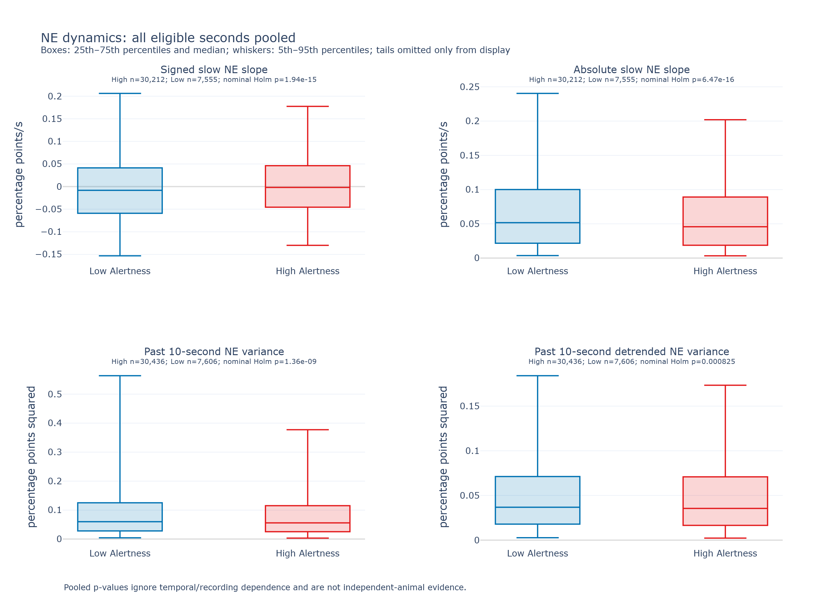

# NE dynamics: pooled High and Low Alertness seconds

**Status:** ten-file pooled-seconds exploratory analysis, September 23, 2026.

All ten aligned files contributed. Every eligible High or Low Alertness second was pooled, irrespective of recording, using the saved normalized percentage delta-F/F values with no further normalization or per-recording weighting. The preceding 10-second history may cross any states.

All four pooled distribution tests are below 0.05 after Holm correction. Signed slow slope is higher in High Alertness; absolute slope and both trailing variance measures are higher in Low Alertness. The rank-biserial effects are small (absolute values 0.025–0.061), and the distributions overlap substantially.

## Pooled results

| Measure | High median | Low median | Rank-biserial effect | Nominal p | Holm-adjusted nominal p |
|---|---:|---:|---:|---:|---:|
| Signed slow slope | -0.00178413 | -0.00827754 | 0.0600 | 6.462e-16 | 1.939e-15 |
| Absolute slow slope | 0.045831 | 0.0517193 | -0.0613 | 1.618e-16 | 6.471e-16 |
| Past 10-second variance | 0.0559066 | 0.0600402 | -0.0457 | 6.782e-10 | 1.356e-09 |
| Past 10-second detrended variance | 0.0355324 | 0.0368658 | -0.0248 | 0.0008245 | 0.0008245 |

Slopes use 30,212 High and 7,555 Low seconds; variances use 30,436 High and 7,606 Low seconds. Slope units are percentage points/s; variance units are percentage points squared. Positive rank-biserial effects indicate higher values in High Alertness. The effect is 2U/(nHigh × nLow) − 1.



Boxes show the pooled median and 25th–75th percentiles; whiskers show the 5th–95th percentiles. Tail points are omitted only from this display. All finite values, including tails, contribute to the statistics; no subsampling or winsorization was applied.

## Interpretation caveat

The saved NE normalization supplies common nominal units, but does not guarantee identical baseline, gain, sensor response, or noise across recordings. Longer recordings and more prevalent states contribute more seconds. Adjacent seconds, overlapping histories, and repeated sessions are dependent. The pooled Mann–Whitney p-values therefore use an independence assumption that these data do not satisfy: they are nominal, pseudoreplicated exploratory results, not independent-animal significance. Holm correction addresses the four comparisons but does not correct that dependence. Mann–Whitney tests distributions, not solely medians.

## Measurements and alignment

- **Slow slopes:** a fourth-order Butterworth forward/backward low-pass has an effective −3 dB cutoff at 0.1 Hz. Each second receives an OLS slope and its absolute value. Finite NE segments are filtered separately, with fixed 30-second edge guards.
- **Trailing variance:** saved processed NE samples in `[s-10, s)` for a score second starting at `s`, without the additional low-pass. Detrended variance removes an OLS line from that same window. Both variances divide by the sample count.
- **Common aligned interval:** excess NE at the end is removed in memory before filtering, retaining all ten files. `mouse5_day1` has 63 excess samples removed (original duration excess 6.246 s); `408_yfp` has 251 removed (24.683 s). Source MAT files and labels remain unchanged. If NE ends first, incomplete final score seconds remain unavailable.

The full labeled collection contains 30,497 High and 7,623 Low seconds. Missing feature estimates reflect filter boundaries, unavailable history, invalid NE, or incomplete score seconds. No state-history exclusions are used. Features are calculated separately on each continuous source trace before pooling the resulting seconds; histories never join different files.

The common-start handling follows the existing [recording report](preliminary_recording_report.md#recordings-grouping-and-input-handling). The earlier dynamics exclusion/recording-summary result is [retained as superseded history](../archive/ne_dynamics_v1_recording/report.md).

## Reproduction

```powershell
conda activate sleep_scoring_dash3.0
python scripts/analyze_ne_dynamics.py --input-dir data --feature-dir data/derived_features/ne_dynamics_v2_pooled_20260923 --results-dir results/ne_dynamics_v2_pooled_20260923
python scripts/render_ne_dynamics.py --results-dir results/ne_dynamics_v2_pooled_20260923 --png
```

Use fresh output names when rerunning. The versioned feature directory contains one NPZ per source file; the results directory contains `pooled_comparisons.csv`, `source_audit.csv`, per-file feature coverage for auditing, source/code hashes, and standalone HTML/PNG plots. The audit retains provenance, but recording identity does not enter the pooled comparison. No recording-comparison test or plot is generated.

Technical definitions: [feature extraction](../wake_ne_analysis/ne_dynamics.py), [pooled statistics](../wake_ne_analysis/dynamics_summary.py).
