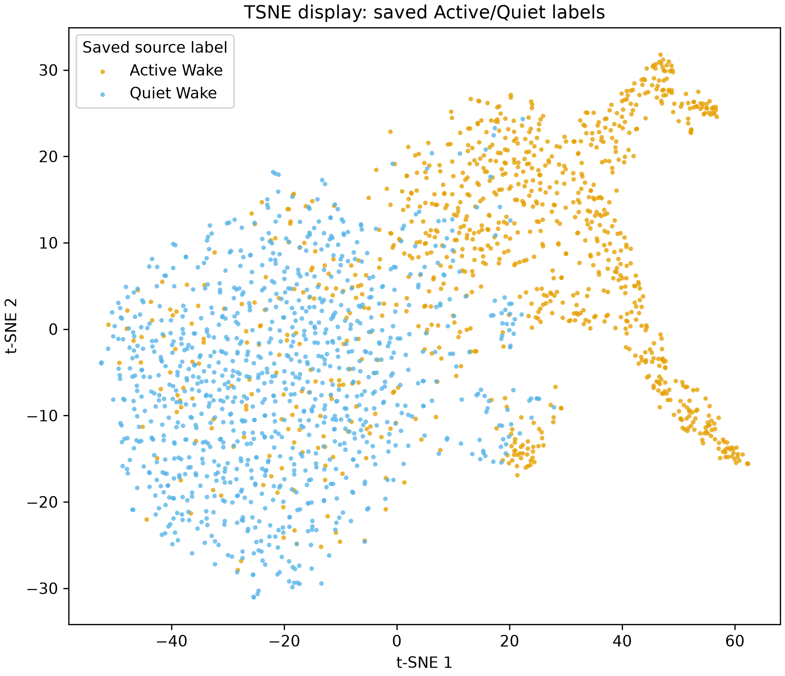
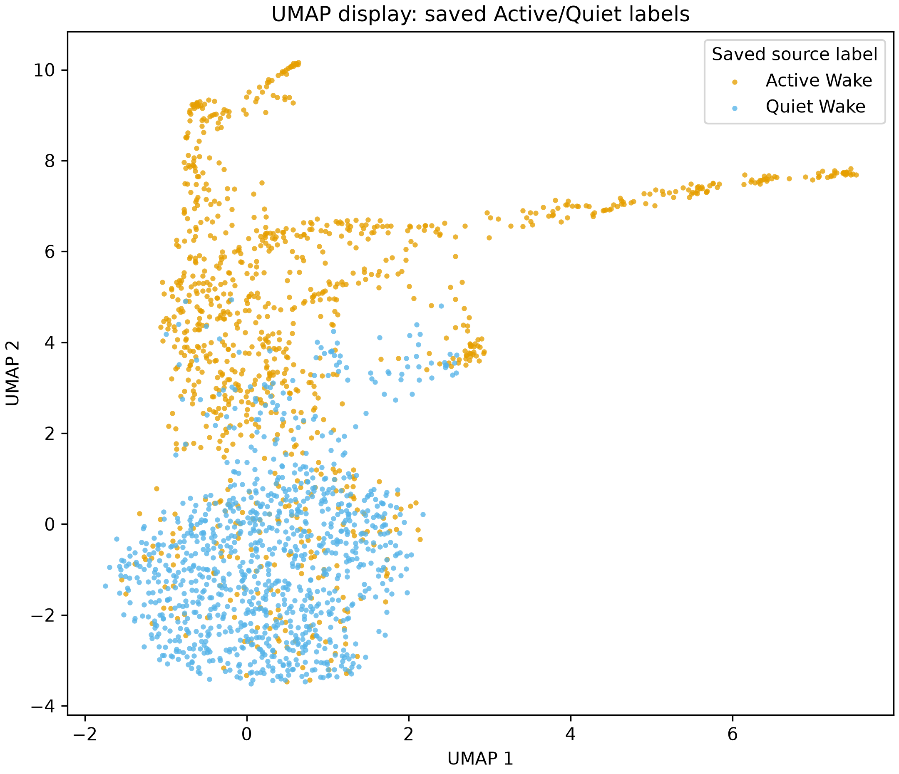
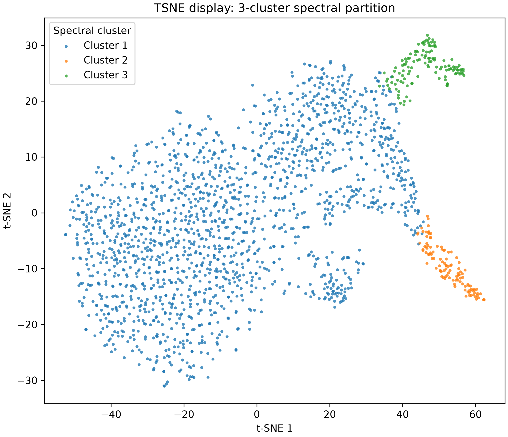
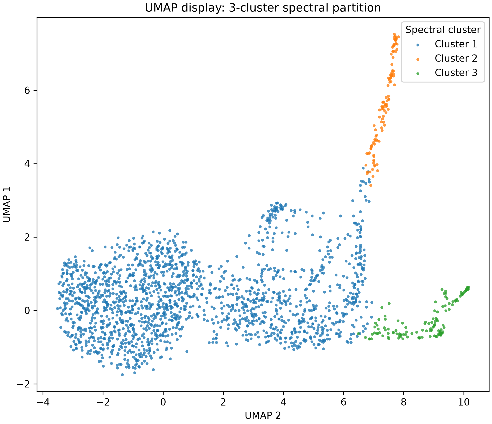

# NREM-baseline Wake-labeling cluster-target follow-up

**Status:** completed on 2026-09-21. This report builds on the
[Wake-only cluster visualization follow-up](cluster_visualization_wake_only_report.md).
It does not replace the saved labels or the prior clustering result.

## Question

Can a stricter, NREM-referenced EMG rule label the two compact Active-only ends
of the existing three-group Wake partition as High Alertness, while leaving the
broad mixed group Low Alertness?

This is a source-preserving algorithm comparison. The three-group graph was held
fixed as the target, and no t-SNE or UMAP coordinate was used to choose a rule.
The aim is correspondence with that existing joint-feature organization, not a
claim that it defines a biological ground truth or a new Wake subtype.

## Inputs and target

The feature set, sampled seconds, graph construction, and display settings are
exactly those in the Wake-only follow-up. In brief, the fixed sample contains
2,000 Wake seconds from ten recordings, balanced by the existing saved
Active/Quiet labels. The label-blind three-group graph has two Active-only ends:
cluster 2 (111 seconds in eight recordings) and cluster 3 (126 seconds in four
recordings). Together, these 237 seconds are the target.

The experimental rule reads raw EMG and the existing NREM/Wake stage mask from
the same local MAT files. It writes only an audit; it does not modify any source
MAT file or saved `sleep_scores`.

## Experimental label rule

Instead of requiring 80% of each recording's Wake time to be Active, this
experiment treats activity as sustained EMG that is high relative to that
recording's NREM EMG. The resulting threshold is recording-specific, but one
shared strictness multiplier is used across recordings. Details and the exact
equation are in the [Appendix](#appendix-nrem-baseline-rule-and-selection).

## Results

### Existing saved labels on the display maps

These are the existing source labels used to select the original balanced sample.
They are shown for comparison only. As described in the preceding report, the
source labels overlap substantially in the central region.





### Fixed label-blind three-group partition

These panels show the same points, coloured by the fixed graph partition. The
green and orange compact ends are the two Active-only target groups. The large
blue group is the broad mixed group; it contains every sampled Quiet second and
many source Active seconds.





### Threshold trade-off

For each multiplier, **precision** is the fraction of experimentally Active
sampled seconds that belong to either target group; **recall** is the fraction
of the 237 target seconds selected as experimentally Active. These values apply
to the fixed, balanced 2,000-point display sample, not to natural Wake-time
prevalence.

| NREM robust-SD multiplier | Active share of all Wake time | Target precision | Target recall | Target-recording F1 |
|---:|---:|---:|---:|---:|
| **10 (selected)** | **27.6%** | **54.4%** | **92.0%** | **64.7%** |
| 12.5 | 22.3% | 60.1% | 83.1% | 56.3% |
| 15 | 18.5% | 65.7% | 75.1% | 57.4% |
| 20 | 13.1% | 72.1% | 62.0% | 52.3% |
| 25 | 9.6% | 77.6% | 52.7% | 49.3% |
| 32 | 6.3% | 79.0% | 33.3% | 37.5% |

The selected multiplier of 10 maximized mean F1 across recordings containing
target points. It selects 218/237 target seconds, but also 183 sampled seconds
outside the target. Stricter rules improve precision only by missing more of the
target groups; no tested multiplier selects only the two target groups.

### Whole-recording Wake-time composition

Duration must be computed from every Wake second, rather than the balanced
display sample. At the selected multiplier, the experimental rule labels 10,539
of 38,120 Wake seconds as Active (27.6%) and 27,581 as Quiet (72.4%). The
existing source labels are 30,497 Active seconds (80.0%) and 7,623 Quiet seconds
(20.0%).

The NREM-referenced rule does not force a common percentage within recordings:
the experimental Active fraction ranges from 2.3% to 65.0% across these ten
recordings.

## Interpretation caveat

The absence of a perfect match has two plausible, non-exclusive explanations.

First, the NREM-baseline rule is a one-dimensional description of sustained EMG
relative to NREM. The graph target is a partition of 29 joint EEG, EMG, and NE
features. The two definitions need not draw the same boundary, even though both
are EMG-associated.

Second, the current graph sample was balanced using the source Active/Quiet
labels. If a new labeling rule were used to remake that sample and refit the
graph, the target itself could change. This experiment avoids that moving-target
problem by holding the original graph assignments fixed. Its imperfect precision
therefore remains evidence that the target is not captured by a single
NREM-referenced EMG threshold alone.

This does not establish that the target groups are distinct physiological states.
The parent report showed that conspicuous Wake structure was not retained after
removing EMG features. The compact groups also do not recur in every recording.

## Fairer next design

1. Define coarse Wake independently of the Active/Quiet split, then draw one
   fixed per-recording Wake sample without balancing on either subtype label.
2. Split by recording before any target selection or threshold tuning. Construct
   and define the graph target in development recordings only.
3. Tune the NREM multiplier only in development recordings, then evaluate target
   precision and recall in held-out recordings using a predeclared target-assignment
   method.
4. Review representative raw EMG/envelope traces for selected and missed target
   seconds, and repeat the comparison after a predeclared feature-panel sensitivity
   check.

This design prevents relabeling and reclustering from chasing each other, while
testing whether the stricter EMG rule generalizes beyond the recordings used to
choose it.

## Reproducibility and retained audits

The experiment was generated with:

```powershell
& "C:\Users\yzhao\miniconda3\condabin\conda.bat" run --no-capture-output -n sleep_scoring_dash3.0 python scripts/calibrate_nrem_baseline.py `
  --input-dir data `
  --clustered-points results/wake_knn_clusters_20260918/3_clusters/clustered_wake_points.csv `
  --target-clusters 2 3 `
  --output-dir results/nrem_baseline_calibration_20260921_duration_audit
```

The ignored results directory retains the full multiplier sweep, per-recording
threshold and duration audits, selected predictions for every sampled point, and
the machine-readable selection rule.

## Appendix: NREM-baseline rule and selection

For each recording, raw EMG is detrended, zero-phase band-pass filtered from 20
Hz to `min(200, 0.45 × sampling rate)`, and converted to a 0.5-second moving-RMS
envelope sampled at 20 Hz. Let \(E_{\mathrm{NREM}}\) be finite envelope values in
seconds labelled NREM. The threshold for multiplier \(m\) is

\[
T(m) = Q_{0.75}(E_{\mathrm{NREM}}) + m \times 1.4826 \times
\operatorname{MAD}(E_{\mathrm{NREM}}).
\]

Only bins in existing coarse Wake (the union of saved High and Low Alertness) are
eligible. Above-threshold gaps of at most 0.5 seconds are joined; runs shorter
than one second are removed. A one-second Wake interval is experimentally Active
when at least half of its twenty envelope bins remain active. All other existing
Wake seconds are experimentally Quiet.

The sweep tested \(m = 0, 0.25, \ldots, 32\). It selected the multiplier with
the highest mean F1 across the nine recordings containing at least one target
point. Ties would favour higher mean specificity across all recordings, then the
stricter multiplier. This selection uses graph membership only; it never uses
t-SNE or UMAP coordinates.
