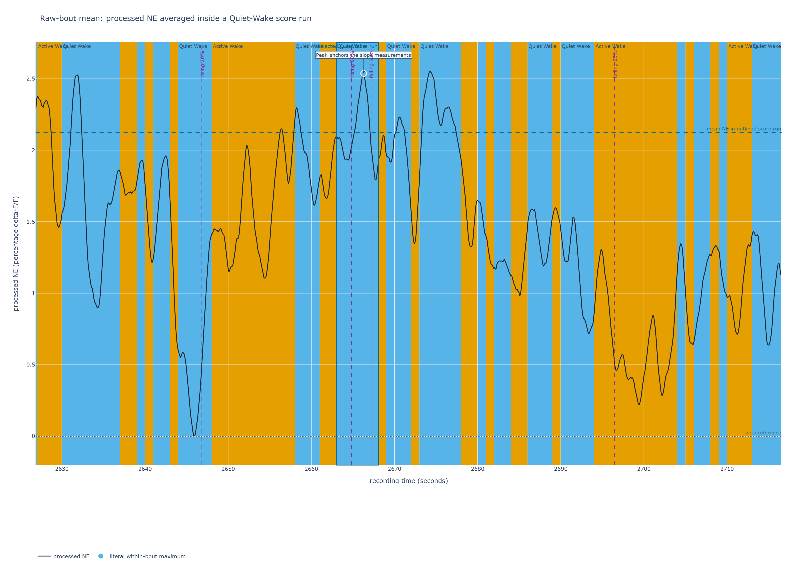
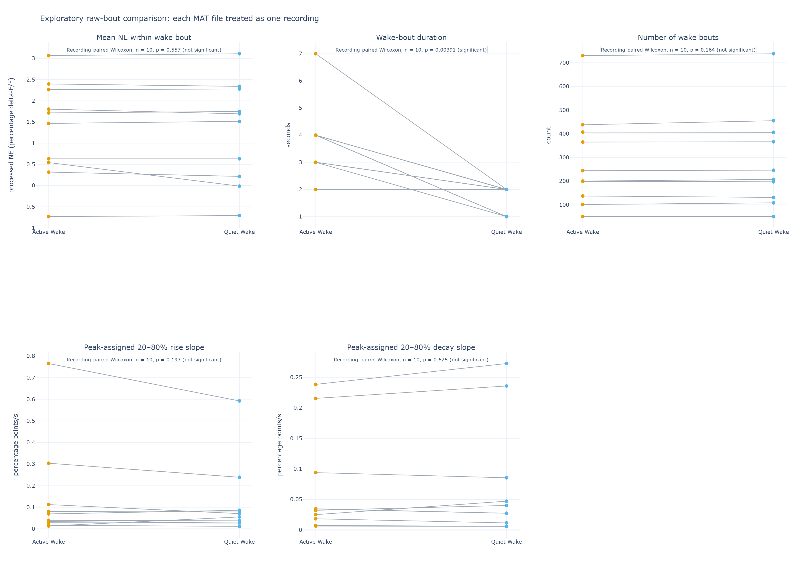
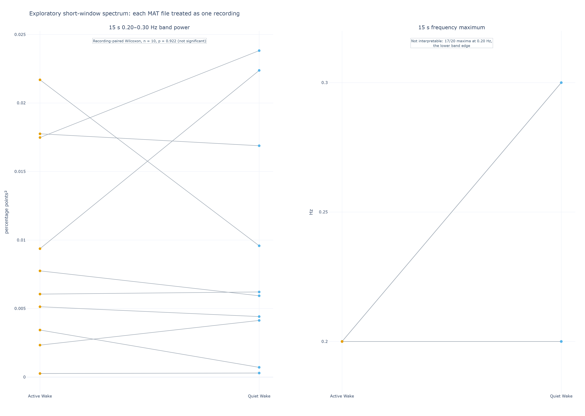
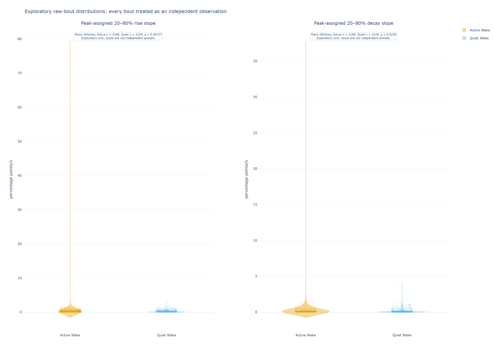
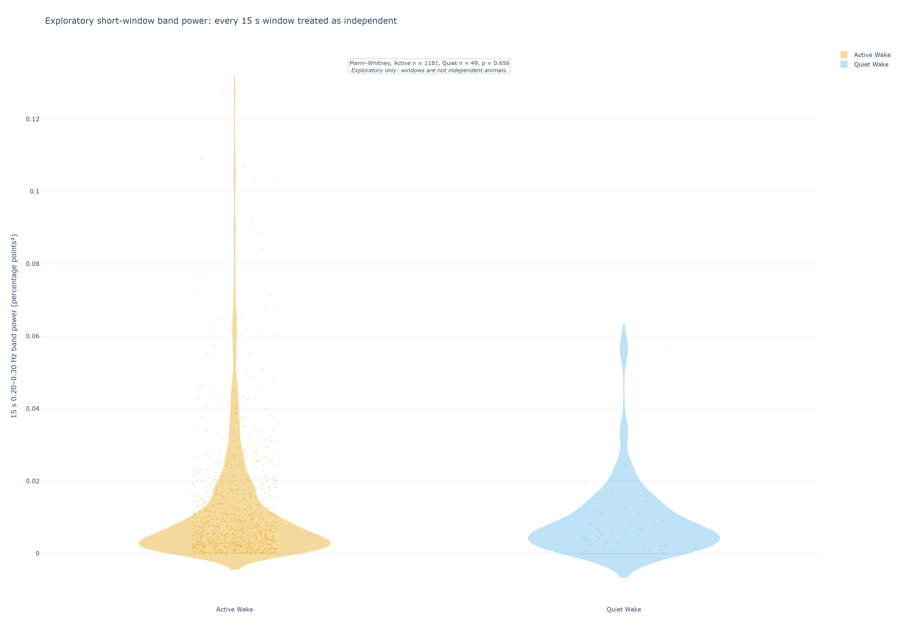

# Preliminary recording-level report: NE during Active and Quiet Wake

**Status:** descriptive ten-recording analysis, 2026-09-17. This report replaces
the archived 2026-09-16 cohort drafts for the current input set. Each MAT file
supplies one paired Active/Quiet recording summary. Some filenames suggest separate
sessions from the same mouse and two do not establish a mouse identity; files are
therefore useful recording units, but not independent biological animals.

## Executive summary

- All 10 supplied MAT files contributed. Final one-second labels were read unchanged:
  Active Wake is 4 and Quiet Wake is 5.
- The recording-level signal measure is the **mean saved processed NE within each
  scored bout**, not the within-bout maximum. Active and Quiet median file summaries
  were 1.590 (IQR 0.565–2.148) and 1.604 (0.321–2.146) percentage delta-F/F,
  respectively (paired Wilcoxon p = 0.557). This screen does not establish a
  mean-NE difference.
- Wake bouts were shorter in Quiet Wake: file-median duration 4 s (3–4) in
  Active versus 2 s (1.25–2) in Quiet (p = 0.00391). File-median bout counts were
  222 (152.5–396.5) and 226.5 (147.5–396.0; p = 0.164).
- The pooled-bout table and plot intentionally omit mean NE. Different recordings
  can have different signal baselines and shared within-session structure. Pooled
  slopes are descriptive, pseudoreplicated distributions only.
- Short-window spectral power also has no recording-level signal (p = 0.922). All
  20 frequency maxima are band edges (17 at 0.20 Hz; 3 at 0.30 Hz), so no preferred
  frequency is resolved.

## Summary of results

Values are median (interquartile range). The first table summarizes one median per
state per MAT file, then compares the matched summaries. Its Wilcoxon values are
recording-level screens, not independent-mouse inference.

| Reported measure | Active Wake | Quiet Wake | Recording pairs | p-value / interpretation |
|---|---:|---:|---:|---|
| Mean processed NE within wake bout (percentage delta-F/F) | 1.590 (0.565–2.148) | 1.604 (0.321–2.146) | n = 10 | 0.557; no nominal recording-level difference |
| **Wake-bout duration (s)** | **4 (3–4)** | **2 (1.25–2)** | n = 10 | 0.00391; median bout duration within each file, then paired across files |
| **Number of wake bouts per recording** | **222 (152.5–396.5)** | **226.5 (147.5–396.0)** | n = 10 | 0.164; count of uninterrupted state-labelled bouts per file |
| Zero-referenced, peak-anchored 20–80% NE rise slope (percentage points/s)† | 0.0545 (0.0301–0.1049) | 0.0631 (0.0301–0.0855) | n = 10 | 0.193; contextual recording-level screen |
| Zero-referenced, peak-anchored 20–80% NE decay slope (percentage points/s)† | 0.0333 (0.0200–0.0791) | 0.0338 (0.0155–0.0759) | n = 10 | 0.625; contextual recording-level screen |

†The literal within-bout maximum is retained only to anchor the unchanged
zero-referenced slope calculations. It is not the reported signal-level
comparison. Full shapes can cross saved score boundaries, so they are not
wake-bout measurements.

The next table deliberately disregards recording and mouse/session membership. It
contains no pooled mean-NE comparison. Its Mann–Whitney values describe available
bouts only and must not be used as biological inference.

| Reported measure | Active Wake | Quiet Wake | Active observations | Quiet observations | Nominal Mann–Whitney p-value |
|---|---:|---:|---:|---:|---:|
| **Wake-bout duration (s)** | **4 (2–10)** | **1 (1–3)** | 2,871 | 2,904 | 9.37 × 10⁻¹⁷⁴ |
| Zero-referenced, peak-anchored 20–80% NE rise slope (percentage points/s)† | 0.0627 (0.0114–0.3149) | 0.0528 (0.0095–0.2660) | 2,198 | 2,129 | 0.00727 |
| Zero-referenced, peak-anchored 20–80% NE decay slope (percentage points/s)† | 0.0434 (0.0081–0.1409) | 0.0334 (0.0069–0.1341) | 2,198 | 2,129 | 0.0236 |

### Wake-bout duration and count

Each uninterrupted sequence of seconds labelled Active Wake or Quiet Wake is one
wake bout. This table is a direct description of those labels: it does not use the
NE waveform. “Total duration” means all seconds assigned to that state across the ten
recordings; “total number of bouts” is the number of uninterrupted sequences; and
the two duration rows distinguish all bouts pooled together from one typical duration
per recording.

| Wake-bout summary | Active Wake | Quiet Wake | What it means |
|---|---:|---:|---|
| Total duration in state (s) | 30,497 | 7,623 | Quiet is 20.0% of all labelled Wake time |
| Total number of wake bouts | 2,871 | 2,904 | Similar counts do not mean equal time in state |
| Typical duration across all bouts (s) | 4 (2–10) | 1 (1–3) | Median (IQR) of every bout across all recordings; descriptive only |
| Typical duration per recording (s) | 4 (3–4) | 2 (1.25–2) | Median (IQR) of the ten file-level medians; paired p = 0.00391 |

The short-window spectrum uses each file's common labelled interval and non-overlapping
15-second state-pure windows in the 0.20–0.30 Hz band.

| Short-window spectral measure | Active Wake | Quiet Wake | Recording pairs | p-value / interpretation |
|---|---:|---:|---:|---|
| 15 s 0.20–0.30 Hz band power (percentage points²) | 0.00690 (0.00386–0.01545) | 0.00607 (0.00421–0.01506) | n = 10 | 0.922; no nominal recording-level difference |
| Frequency maximum in that band (Hz) | 0.20 (0.20–0.20) | 0.20 (0.20–0.275) | n = 10 | Not interpretable; all 20 values are band edges |

The deliberately pooled window description has 1,181 Active and 49 Quiet windows;
band-power medians are 0.00640 (0.00253–0.01405) and 0.00619 (0.00276–0.01176),
respectively (nominal Mann–Whitney p = 0.656). It is pseudoreplicated and does not
replace the recording-level result.

## Methodology

### Sleep scoring and Active/Quiet Wake labels

This analysis consumes final one-second `sleep_scores` without relabeling them. The
current upstream method detrends raw EMG, band-pass filters it from 20 Hz to the lower
of 200 Hz or 45% of sampling rate, then calculates one true RMS value for each score
second. Within a recording, remaining Wake seconds are ranked by RMS; the
highest-ranked seconds become Active until the final recording targets 80% Active and
20% Quiet Wake. Explicit manual labels remain authoritative. This is a relative
within-recording EMG-activity split, not an absolute calibrated movement measure.

### Recordings, grouping, and input handling

The paired-analysis unit is a MAT file. Each file contributes an Active and Quiet
median, joined as a pair in Figure 2. The 10 files are retained as requested; where
signal duration exceeds labelled duration, only their common start interval is used
for NE and spectra, without changing the source MAT file.

Filename hints are not a verified experimental design. Repeated-file structure can
correlate pairs, so file-level p-values are descriptive screens, not a replacement
for a predeclared mouse- or session-level analysis once complete metadata exist.

### Mean NE within each wake bout, duration, and count

For every maximal contiguous Active or Quiet score run with finite NE samples, the
analysis calculates the arithmetic mean of its saved processed percentage delta-F/F
samples. No local baseline, detrending, additional smoothing, or normalization is
applied. Each file/state value in the first table is the median of its bout means.
Directly pooling mean NE across files is deliberately omitted.

Wake-bout duration and count are calculated directly from the saved one-second labels,
including every maximal uninterrupted label sequence. They are not inferred from the
NE waveform or the slope measurements below.



**Figure 1.** The dashed line is the reported mean NE for the outlined Quiet score
run. The marked maximum is retained only to define the existing zero-referenced
slopes.

### Peak-anchored slopes

The preserved shape metrics choose the literal maximum inside each labelled run and
locate 20% and 80% crossings relative to that raw, zero reference across the
continuous finite trace. The reported slopes are central 20–80% secants, expressed
as positive rise and decay magnitudes. They are not local-baseline event kinetics,
T1/2 values, or wake-bout durations, and their support can cross a score boundary.

### Short-window spectral power and frequency maximum

Spectra use non-overlapping 15-second state-pure windows; incomplete tails are
dropped and no bouts are joined. Each window is mean-centered, Hann-windowed, and
analyzed with a density-scaled periodogram. A file's state spectrum averages its
windows; band power is integrated from 0.20 to 0.30 Hz.

Legacy forward/backward near-one-second moving-average smoothing supports slow
state-scale interpretation through roughly 0.2 Hz and requires caution to 0.3 Hz.
The band is a constrained feasibility range, not a full frequency characterization;
edge maxima are unresolved rather than rhythms.

## Results

### Paired recording summaries

Figure 2 shows all ten file-level Active/Quiet pairs. The within-bout mean-NE panel
has no nominal difference. Duration is shorter in Quiet Wake, while the number of
wake bouts has no nominal paired difference. Slope panels retain their contextual
interpretation.



**Figure 2.** One line per MAT file joins its Active and Quiet summary. These are
paired recording summaries, not independent-mouse estimates.

### Spectral result

The ten paired recording spectra do not show a nominal band-power difference.
Frequency maxima are unresolved: every value is either the lower 0.20 Hz edge (17)
or upper 0.30 Hz edge (3). This does not establish a preferred oscillation or
equality of frequencies.



**Figure 3.** One averaged 15-second-window spectrum per state per MAT file. Edge
maxima are a feasibility limitation, not a biological frequency finding.

### Pooled-bout exploratory description

Figure 4 intentionally displays no mean-NE panel. Pooling mean level across files
would obscure file-specific baseline/scale differences, and no pooled test can turn
correlated bouts or repeated sessions into independent observations. Slope panels
remain only as raw distributional diagnostics.



**Figure 4.** Every eligible bout is shown with a violin/box summary. Bouts share
recording context and may share mouse/session identity, so this is exploratory and
pseudoreplicated.

The equivalent all-window spectral display is likewise descriptive: its 1,181 Active
and 49 Quiet windows are strongly imbalanced and correlated within file.



**Figure 5.** All eligible fixed windows document coverage and distribution rather
than independent replication.

## Interpretation for the proposal

The refreshed screen did not establish a systematic difference in mean processed NE
within scored bouts. That is not evidence of biological equality. Quiet Wake score
runs are shorter and more fragmented under the supplied relative EMG-label method;
their counts remain comparable because fragmentation creates many short runs.

Slopes and spectra are preserved without overclaiming them. They retain dependence on
processed-signal scale, preprocessing, coverage, and session context; frequency
maxima are edge constrained. Verified mouse/session metadata and a predeclared
hierarchical or mouse-level analysis are needed for a biological state conclusion.

## Appendix A: statistical interpretation

The paired Wilcoxon calculation compares each file's Active and Quiet summary. It
preserves within-file pairing but treats file pairs as observations; repeated sessions
from one mouse violate the stronger independent-animal interpretation. Pooled
Mann–Whitney calculations ignore recording and mouse membership, so their p-values
are distributional diagnostics only. Neither test corrects for missing verified
session, mouse, condition, or circadian metadata.

## Reproducibility

```powershell
python scripts/build_recording_report.py --input-dir data --output outputs/recording_report_20260917
python scripts/render_recording_report_figures.py --analysis outputs/recording_report_20260917 --output writeups/assets/recording_report_20260917
```

The MAT files and output tables are locally ignored; static figures are the
reviewable report artifacts. The renderer requires a new or empty output directory,
which prevents mixing a later run with these figures.
